# Technische Architektur

> **Stand:** 2026-06-26 · Lebende Doku, generiert aus `features/INDEX.md` + Code. Dokumentiert: alle nicht-`Planned`-Features (PROJ-1–27, 28–47, 49).
> **Jupiter-Override:** Next.js statt Flutter · FastAPI **in-memory + SQLite** statt Neon/ORM · **kein** MinIO (Dateien host-nativ) · JWT-Auth seit PROJ-25 (Login-Screen + httpOnly-Cookie).

## 1. System-Überblick

Jupiter ist eine **selbstgehostete Kommandozentrale**, die mehrere **Claude-Code-Headless-Sessions** (`claude -p --output-format stream-json`) als überwachbare Flotte orchestriert. Das **Cockpit** (Next.js) zeigt Sessions als Kanban-/Ampel-Kacheln und einen ABC-Workflow-Gantt; das **Backend** (FastAPI) startet/steuert die Claude-Subprozesse, hält ihren Live-Zustand **in-memory**, spiegelt ihn best-effort in einen **SQLite-Live-Index** und schreibt lesbare Artefakte in den **Hal-Vault** (Obsidian-Markdown) als persistente Wahrheit. An Schaltstellen pausiert eine Session und erzeugt eine **Decision Card**, die der Nutzer freigibt. Seit PROJ-25 sichert ein **JWT-Login** den Zugang; seit PROJ-26 gibt es einen **Marktplatz** für Rollen/Skills/Agenten; seit PROJ-22 können **Multi-Agent-Fleets** aus dem Cockpit dispatched werden.

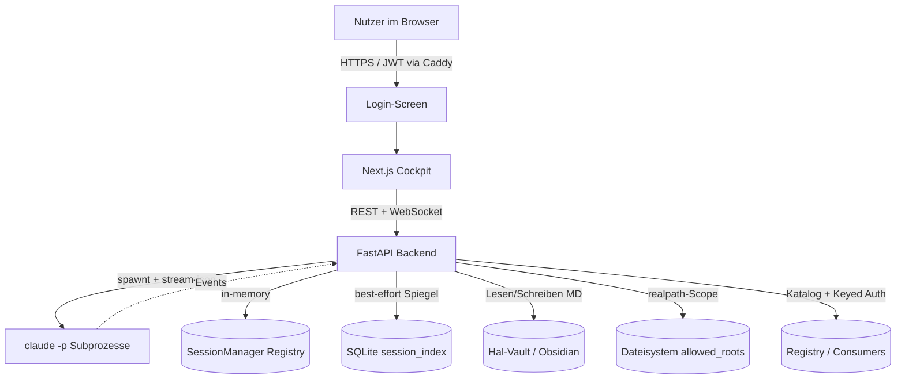

## 2. Tech-Stack

- **Frontend:** Next.js 16 (App Router), React, TypeScript, Tailwind CSS, shadcn/ui. State über React-Provider/Hooks (`sessions-provider.tsx`). Polling (4 s) + WebSocket mit Keepalive-Ping (PROJ-49) + Full-Snapshot bei (Re-)Connect.
- **Backend:** FastAPI (Python 3.11+, Conda-Env `Dashboard`), Pydantic v2. **Kein ORM** — Zustand in-memory (`SessionManager`), Persistenz via stdlib `sqlite3` (WAL, off-thread).
- **Engine:** Claude Code headless (`claude -p`, Stream-JSON, Subscription-Auth, **kein** API-Key); weitere Engines via `GenericCliDriver` + `EngineRegistry` (PROJ-18). Modell-Routing via `--model`.
- **Auth:** JWT HS256 (15 min Access-Token im Memory + 7 d Refresh-Token als httpOnly-Cookie) seit PROJ-25. Vorher: Caddy Basic-Auth / Tailscale.
- **Persistenz:** SQLite-Live-Index (`~/jupiter-data/session_index.db`) + Auth-DB (users, refresh_token_registry) + Video-Queue (`video_summary_queue`) — schneller Spiegel, **nicht** die Wahrheit.
- **Wahrheit:** Hal-Vault (`/home/dev/tools/Hal`, Obsidian/PARA, offenes Markdown).
- **Dateien:** host-natives Dateisystem innerhalb `allowed_roots` (kein Object-Storage).
- **Registry / Marketplace:** file-first `.jupkg`-Pakete für Rollen, Skills, Agenten (PROJ-26). Consumer-Key-Auth für den geteilten Vault-Dienst (PROJ-24).
- **Config (live-reload):** YAML-Dateien mit mtime-Watch — `policy.yaml`, `watchdog.yaml`, `liveness.yaml`, `engines.yaml`, Konstitutions-MD.
- **Spracheingabe:** faster-whisper lokal + optionaler Groq-Cloud-Fallback (PROJ-20).
- **Deploy:** host-nativ auf Dev-VPS (systemd `jupiter-backend`/`-frontend`, Caddy-TLS, GitHub-Webhook Auto-Deploy auf `jupiter.auxevo.tech`).

## 3. Datenmodell

Jupiter hat **kein relationales Schema im klassischen Sinn**. Es gibt drei Speicher-Ebenen:

1. **In-Memory (Wahrheit des Live-Zustands):** `SessionManager._sessions: dict[str, SessionRuntime]` mit `SessionState`.
2. **SQLite-Live-Index (Restart-Spiegel):** Tabellen `session_index`, `users`, `refresh_token_registry`, `video_summary_queue`.
3. **Vault + Dateisystem (persistente Wahrheit / Artefakte):** Markdown-Logs, Handovers, kuratiertes Wissen; Registry-Pakete (`.jupkg`).

```mermaid
erDiagram
  session_index {
    TEXT session_id PK
    TEXT owner
    TEXT project_path
    TEXT project_name
    TEXT model
    TEXT permission_mode
    TEXT role
    TEXT status
    INTEGER pid
    TEXT error
    TEXT created_at
    TEXT last_activity
    INTEGER tokens_used
    REAL total_cost_usd
    TEXT parent_session_id
    TEXT child_session_id
    TEXT abc_phase
    TEXT abc_phase_reached
    TEXT abc_feature
    BOOLEAN recovery_dismissed
    TEXT drained_at
  }
  users {
    TEXT id PK
    TEXT username UNIQUE
    TEXT hashed_password
    TEXT created_at
  }
  refresh_token_registry {
    TEXT jti PK
    TEXT user_id FK
    TEXT expires_at
    BOOLEAN revoked
  }
  video_summary_queue {
    TEXT id PK
    TEXT url
    TEXT status
    TEXT created_at
    TEXT finished_at
    TEXT error
    TEXT output_path
  }
  session_index ||--o| session_index : "parent_session_id (Handover-Kette)"
  users ||--o{ refresh_token_registry : "hat Refresh-Tokens"
```

- **Index:** `idx_session_index_status` auf `status`.
- **Kein `mandant_id`, keine RLS** — Single-User. `owner`-Feld ist Vorbereitung für Team-Migration (PROJ-25 Grundlage vorhanden).

## 4. Auth & Zugang

Seit **PROJ-25** ist Jupiter hinter einem echten JWT-Login gesichert:

- **Login-Screen:** `GET /auth/status` → Bootstrap-Check; `POST /auth/login` → Access-Token (JSON) + Refresh-Token (httpOnly-Cookie). Rate-Limiting: 5 Versuche/30 s.
- **Access-Token:** 15 min, HS256 JWT; `owner` aus Token, nie vom Client.
- **Refresh:** `POST /auth/refresh` erneuert über das httpOnly-Cookie (7 d).
- **Logout:** `POST /auth/logout` revokiert das Refresh-Token in der DB.
- **Bootstrap:** Erster Start ohne User → `POST /auth/bootstrap` legt den Account an (einmalig).
- **Schutz interner Endpunkte:** `Depends(get_current_user)` auf allen geschützten Routen; `/internal/permission` (Permission-Callback) ist localhost-only.
- **Pfad-Sicherheit:** `realpath`-Scope-Prüfung gegen `allowed_roots` als zweite Grenze (Traversal/Symlink-Schutz).
- **Shared-Vault-Consumers (PROJ-24):** Externe Dienste (Paperclip, Wayland) authentifizieren sich mit einem Consumer-Key (`X-Vault-Consumer` + `X-Vault-Key`); Scope (read_paths, write_paths) aus `consumers.yaml`.

## 5. Routing & Navigation

**Next.js-Routen** (`app/`):

| Route | Screen | Zweck |
|---|---|---|
| `/login` | `login/page.tsx` | Einloggen / Bootstrap (PROJ-25) |
| `/` | `(cockpit)/page.tsx` | Mission Control: Kanban + Ampel + ABC-Gantt |
| `/sessions/[id]` | `sessions/[id]/page.tsx` | Session-Detail: Transkript, Eingabe, Decision Cards |
| `/doku` | `doku/page.tsx` | MD-Reader + MD-Editor |
| `/dateien` | `dateien/page.tsx` | Fileexplorer (3-Spalten, PROJ-28) |
| `/apps/[key]` | `apps/[key]/page.tsx` | Micro-App (native oder iFrame, PROJ-40) |
| `/orchestration/[key]` | `orchestration/[key]/page.tsx` | Eingebettete Fremd-App (PROJ-39/43) |
| `(layout)` | `layout.tsx` | Shell: `CockpitShell` (Sidebar + Inhalt) |

**FastAPI-Router** (`backend/app/routes/`, Prefixe):

| Prefix | Router | Features |
|---|---|---|
| `/auth` | `auth.py` | PROJ-25 |
| `/sessions`, `/recovery` | `sessions.py` | PROJ-1, 3, 4, 5, 14, 17, 21, 33 |
| `WS /sessions/{id}/stream` | `sessions.py` | PROJ-1, 49 |
| `/vault` | `vault.py` | PROJ-2, 15 |
| `/vault/v1` | `vault_v1.py` | PROJ-24 |
| `/md` | `md.py` | PROJ-7, 12, 31 |
| `/constitution` | `constitution.py` | PROJ-6 |
| `/files` | `files.py` | PROJ-11, 28 |
| `/git` | `git.py` | PROJ-13 |
| `/settings` | `settings.py` | PROJ-5, 10, 16, 20, 27, 45 |
| `/projects` | `projects.py` | PROJ-9 |
| `/transcription` | `transcription.py` | PROJ-20 |
| `/coordinator` | `coordinator.py` | PROJ-22 |
| `/challenge`, `/reviews` | `challenge.py` | PROJ-23 |
| `/registry` | `registry.py` | PROJ-26, 39, 40 |
| `/video-summary` | `video_summary.py` | PROJ-41, 44 |
| `/metrics` | `metrics.py` | PROJ-42 |
| `/terminal` | `terminal.py` | PROJ-43 |

## 6. Features

### PROJ-1 — Engine-Treiber (Claude headless)
Startet und steuert Claude-Code-Subprozesse headless. `ClaudeCodeDriver` spawnt `claude -p --output-format stream-json`, parst den Event-Stream (Tokens/Kosten aus `result`-Events), und hält je Session eine `SessionRuntime` in-memory. Der Live-Stream wird per WebSocket ans Cockpit gebroadcastet.

**Backend:**
| METHOD | Pfad | Schema-In | Schema-Out | Service |
|---|---|---|---|---|
| POST | `/sessions` | `SessionCreate` | `SessionRead` | `SessionManager.create()` |
| GET | `/sessions` / `/sessions/{id}` | — | `SessionRead`/`SessionDetail` | `SessionManager.list/get` |
| POST | `/sessions/{id}/input` | `SessionInput` | `SessionRead` | `SessionRuntime.send_input()` |
| POST | `/sessions/{id}/stop` | — | `SessionRead` | `SessionRuntime.stop()` |
| WS | `/sessions/{id}/stream` | — | Event-Stream | `ClaudeCodeDriver.read_stream()` |

**Frontend:** `sessions/[id]/page.tsx` (Detail), `session-tile.tsx`, `context-gauge.tsx`; State: `sessions-provider.tsx` (Polling) + WebSocket-Hook.
**Daten:** in-memory `SessionRuntime`; gespiegelt nach `session_index` (PROJ-14).
**Ablauf:**
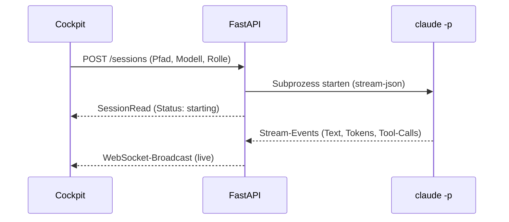
**Abhängigkeiten:** keine.

### PROJ-2 — Vault-Anbindung
Liest/schreibt/sucht Markdown im Hal-Vault als persistente Wahrheit. `VaultService` schreibt **atomar** (temp + `os.replace`), parst YAML-Frontmatter und vergibt Slugs.

**Backend:**
| METHOD | Pfad | Out | Service |
|---|---|---|---|
| GET | `/vault/files?dir=` | `VaultFile[]` | `VaultService.list()` |
| GET | `/vault/file?path=` | `VaultFileRead` | `VaultService.read()` |
| GET | `/vault/search?q=` | `VaultSearchResult[]` | `VaultService.search()` |
| POST | `/vault/files` | `VaultFile` | `VaultService.write()` |

**Daten:** `/home/dev/tools/Hal/Agentic OS/Jupiter/` (`Sessions/`, `Handovers/`, `Knowledge/`).
**Abhängigkeiten:** keine.

### PROJ-3 — Cockpit (Mission Control / Kanban / Ampel)
Die zentrale Übersicht: Sessions als Ampel-Kacheln, gruppiert in einem Kanban (Arbeitet / Wartet / Review / Fertig), darunter der ABC-Gantt.

**Frontend:** `app/(cockpit)/page.tsx`; Komponenten `session-tile.tsx`, `kanban-board.tsx`, `global-status-bar.tsx`, `session-rail.tsx`, `new-session-dialog.tsx`. State: `sessions-provider.tsx`.
**Backend:** `GET /sessions`.
**Ablauf:**
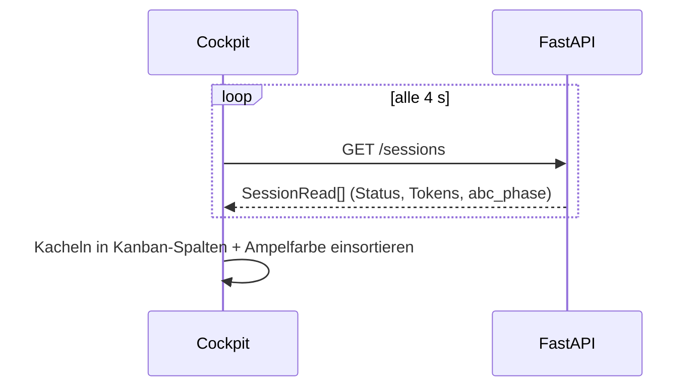
**Abhängigkeiten:** PROJ-1, PROJ-2.

### PROJ-4 — Decision Cards (Freigabe-Flow)
An jedem Tool-Aufruf läuft die Session durch `request_decision()`. Je nach Policy entsteht eine **Decision Card** (`PendingDecision` + blockierende `asyncio.Future`).

**Backend:** `POST /sessions/{id}/decisions/{decision_id}` (`DecisionResolve`). Hook `request_decision()` im Event-Pfad.
**Frontend:** `decision-card.tsx`, `confirm-dialog.tsx`.
**Ablauf:**
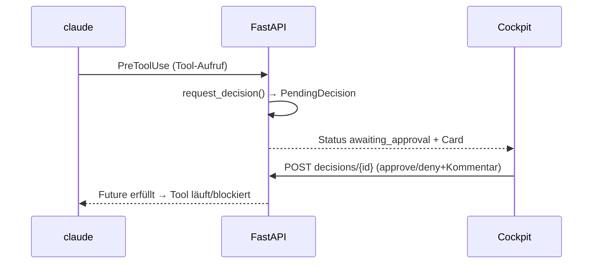
**Abhängigkeiten:** PROJ-1, PROJ-3.

### PROJ-5 — Context-Management & Handover
Hält den Kontext-Füllstand sichtbar und warnt an konfigurierbarer Schwelle. Bei Bedarf erzeugt der Nutzer ein **Handover** (Staffelstab-MD im Vault) und setzt die Session zurück → neue Kind-Session mit Seed-Kontext.

**Backend:** `POST /sessions/{id}/handover/generate` + `/handover`, `POST /sessions/{id}/reset`, `PATCH /sessions/{id}/threshold`. Service: `engine/handover.py`, `SessionManager.reset()`.
**Frontend:** `handover-dialog.tsx`, `reset-session-button.tsx`, `threshold-badge.tsx`, `threshold-control.tsx`.
**Daten:** Handover-MD im Vault (`Handovers/`).
**Abhängigkeiten:** PROJ-1, PROJ-2, PROJ-3.

### PROJ-6 — Knappheits-Konstitution
Injiziert eine token-sparsame Konstitution + Rolle in jede Session via `--append-system-prompt`. `ConstitutionResolver` setzt `global.md` + `roles/<rolle>.md` zusammen.

**Backend:** `GET /constitution`, `GET /constitution/{role}`, `GET /sessions/{id}/constitution`. Service: `engine/constitution.py`.
**Daten:** `backend/constitution/global.md`, `backend/constitution/roles/*.md`.
**Abhängigkeiten:** PROJ-1.

### PROJ-7 — MD-Reader
Read-only-Browser für Markdown aus Vault und Projekt-Roots. Rendert mit react-markdown + GFM, Navigation per Datei-Baum und Wikilinks.

**Backend:** `GET /md/sources`, `GET /md/index?source=`, `GET /md/file?path=`. Service: `engine/md_reader.py`.
**Frontend:** `app/(cockpit)/doku/page.tsx`; `file-tree.tsx`, `markdown-view.tsx`.
**Abhängigkeiten:** PROJ-2.

### PROJ-8 — ABC-Workflow-Gantt
Zeigt unter dem Kanban je Session den Fortschritt durch die 8 ABC-Phasen. `_detect_abc()` erkennt aus den Events den zuletzt aufgerufenen `abc-*`-Skill.

**Backend:** `GET /sessions` (+ vier Felder). Service: `engine/abc_phases.py`.
**Frontend:** `gantt-chart.tsx`.
**Daten:** in-memory + `session_index.abc_*`.
**Abhängigkeiten:** PROJ-3, PROJ-1, PROJ-6.

### PROJ-9 — Smart Launcher
Beim Session-Start liest `LauncherService` die `features/INDEX.md`, ermittelt das reifste Feature, die nächste Phase und ein Modell — als überschreibbarer Vorschlag.

**Backend:** `GET /projects/suggestion?project_path=`. Service: `engine/launcher.py`.
**Frontend:** `new-session-dialog.tsx` (Vorschlag-Card).
**Abhängigkeiten:** PROJ-3, PROJ-1.

### PROJ-10 — Trust-Policy + Phasen-Gate
Konfigurierbare Freigabe-Regeln. `PolicyEvaluator.evaluate(tool, context)` liefert `auto-allow | card | deny`. Hartes Phasen-Gate beim Phasenwechsel greift auch im Bypass.

**Backend:** `GET/PUT /settings/policy`. Service: `engine/policy.py`. Config: `config/policy.yaml`.
**Frontend:** `policy-control.tsx` im `settings-dialog.tsx`.
**Abhängigkeiten:** PROJ-4, PROJ-8, PROJ-1.

### PROJ-11 — Fileexplorer + Clipboard
Vollständiger Fileexplorer + In-Session-Clipboard (Drop/Paste am Eingabefeld → absoluter Pfad). Streaming Up-/Download, `realpath`-Scope.

**Backend:**
| METHOD | Pfad | Service |
|---|---|---|
| GET | `/files/list?path=` | `FileService.list()` |
| GET | `/files/download?path=` | Stream (FileResponse) |
| POST | `/files/upload` (multipart) | `FileService.upload()` |
| POST | `/files/mkdir`/`rename`/`move`/`delete` | `FileService.*` |
| GET/PATCH | `/settings/clipboard-dir` | Clipboard-Pfad |

**Frontend:** `file-explorer.tsx`, `session-clipboard-button.tsx`, `use-file-upload.ts`.
**Daten:** Dateisystem in `allowed_roots`, Clipboard-Ordner.
**Abhängigkeiten:** PROJ-1, PROJ-3, PROJ-7.

### PROJ-12 — MD-Editor (voll)
Erweitert den Reader um Bearbeiten: `POST /md/file` schreibt atomar mit Konflikterkennung (mtime/hash). `[[`-Autocomplete und Backlinks-Panel.

**Backend:** `GET /md/file` (+mtime/hash), `POST /md/file` (`MdSaveRequest`), `GET /md/backlinks?path=`.
**Frontend:** `md-editor.tsx`, `backlinks-panel.tsx`, `frontmatter-panel.tsx`.
**Abhängigkeiten:** PROJ-7, PROJ-2.

### PROJ-13 — Git-Branch-Handling
In-App Git-Operationen innerhalb `allowed_roots`. `GitService` führt parametrisierte Subprozesse aus; Dirty-Tree blockiert Wechsel; Conflict → Abort mit Rollback.

**Backend:**
| METHOD | Pfad | Service |
|---|---|---|
| GET | `/git/status` | `GitService.status()` |
| POST | `/git/switch` | `GitService.switch()` |
| POST | `/git/feature-branch` | `GitService.create_feature_branch()` |
| POST | `/git/promote` | `GitService.promote()` |

**Schemas:** `BranchStatus`, `SwitchRequest`, `FeatureBranchRequest`, `PromoteRequest` — `schemas/git.py`.
**Frontend:** `branch-panel.tsx` (im Fileexplorer/Dateien-Bereich).
**Ablauf:**
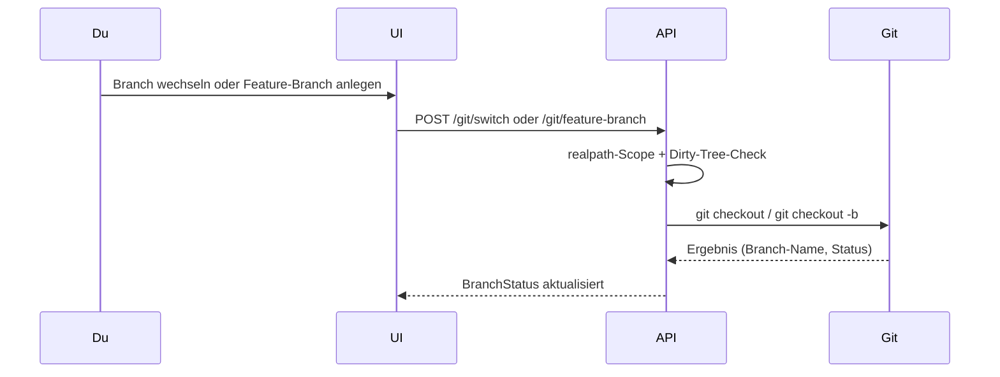
**Abhängigkeiten:** PROJ-3, PROJ-11.

### PROJ-14 — Härtung: Limit + SQLite-Persistenz
Atomar geprüftes Limit gleichzeitig aktiver Sessions + SQLite-Live-Index (nur bei Statuswechseln, off-thread). Beim Start rehydriert `rehydrate()` die Liste; nicht steuerbare Prozesse → verwaist.

**Backend:** `GET /sessions/limits`. Service: `SessionManager.create()` + `backend/app/db/`.
**Daten:** `session_index.db`.
**Abhängigkeiten:** PROJ-1, PROJ-3.

### PROJ-15 — Vault Stufe 3 (Kuratierung)
`engine/curation.py` erkennt Marker (Bug / ADR / Sackgasse) und schlägt eine **kuratierte Notiz** als nicht-blockierende Decision Card vor. Nach Freigabe landet sie in `Knowledge/`.

**Backend:** `POST /vault/files` (type=curated), `GET /vault/search?scope=curated`. Service: `engine/curation.py`.
**Frontend:** `decision-card.tsx` (knowledge_proposal), `knowledge-search.tsx`.
**Abhängigkeiten:** PROJ-2, PROJ-4, PROJ-5.

### PROJ-16 — Amok-Watchdog
`WatchdogMonitor` führt Schiebefenster für Tokens/Zeit, Schreibrate, Stillstand und identische Wiederholungen. Alarm → nächster Tool-Call wird in `watchdog_pause`-Card umgelenkt, **vor** Bypass-Auto-Allow.

**Backend:** `GET/PUT /settings/watchdog`. Service: `engine/watchdog.py`. Config: `config/watchdog.yaml`.
**Frontend:** `watchdog-control.tsx`, `decision-card.tsx` (watchdog_pause).
**Defaults:** 200k Tokens/60 s · 180 s Stillstand · 5 identische Calls · 30 Writes/60 s.
**Abhängigkeiten:** PROJ-1, PROJ-4, PROJ-10.

### PROJ-17 — Recovery über Vault
`get_recovery_candidates()` scannt SQLite (verwaiste Sessions ohne Kind) + Vault (Handovers/Logs) und bewertet Stärke (strong/medium/weak). Wiederherstellung via Reset-Kind-Mechanismus (PROJ-5).

**Backend:** `GET /recovery`, `POST /recovery/{id}/restore`, `POST /recovery/{id}/dismiss`.
**Frontend:** `recovery-banner.tsx`, `recovery-dialog.tsx`.
**Daten:** `session_index.recovery_dismissed` + Vault-Handovers.
**Abhängigkeiten:** PROJ-14, PROJ-5, PROJ-2.

### PROJ-18 — Weitere Engines + iFrame/Launch
`GenericCliDriver` normalisiert je Adapter den Stream; `EngineRegistry` lädt `engines.yaml`. Nicht-Claude-Sessions degradieren claude-spezifische Felder auf „n/v".

**Backend:** `SessionCreate.engine`. Service: `engine/generic_cli_driver.py`, `engine/registry.py`. Config: `config/engines.yaml`.
**Frontend:** `new-session-dialog.tsx` (Engine-Select).
**Abhängigkeiten:** PROJ-1, PROJ-9, PROJ-3.

### PROJ-19 — Effizienz-Ausbau (Token-Dashboard / Caching)
Token- und Kosten-Aggregation in `manager.py`; Prompt-Cache-Hinting (Hash stabiler Prefixe). Token-Fenster-Monitoring als Input für Liveness (PROJ-27).

**Backend:** Token/Kosten-Tracking in `engine/manager.py`, `engine/usage.py`.
**Frontend:** `usage-dashboard.tsx` (Tokens/Kosten je Session).
**Abhängigkeiten:** PROJ-1, PROJ-2, PROJ-5.

### PROJ-20 — Spracheingabe / Push-to-Talk
faster-whisper lokal (kein Browser-Web-Speech-API, DSGVO-konform); optionaler Groq-Cloud-Fallback. Transkription wird an bestehendem Eingabe-Text angehängt (kein Überschreiben).

**Backend:**
| METHOD | Pfad | Service |
|---|---|---|
| POST | `/transcription` | `TranscriptionService.transcribe()` |
| GET/PATCH | `/transcription/settings` | Provider-Wahl (local/cloud) |

**Schemas:** `TranscriptionResult`, `TranscriptionSettingRead/Patch` — `schemas/transcription.py`.
**Frontend:** `push-to-talk-button.tsx`, `transcription-control.tsx` in `sessions/[id]/page.tsx`.
**Ablauf:**
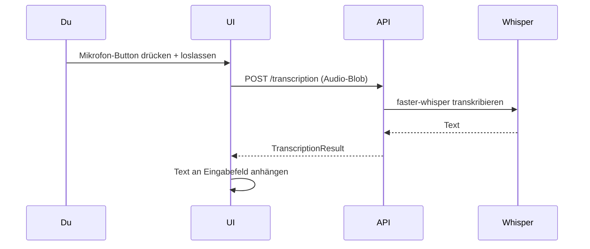
**Abhängigkeiten:** PROJ-9, PROJ-4.

### PROJ-21 — Session-Löschen / Aufräumen
Entfernt terminale Sessions. `delete()` prüft Status (aktiv → 409), killt best-effort via SIGTERM, löscht SQLite-Eintrag. `cleanup_terminal()` als Bulk-Operation.

**Backend:** `DELETE /sessions/{id}`, `POST /sessions/cleanup`. Service: `SessionManager.delete/cleanup_terminal`.
**Frontend:** `delete-session-button.tsx`, `cleanup-button.tsx`, `confirm-dialog.tsx`.
**Abhängigkeiten:** PROJ-1, PROJ-14, PROJ-3.

### PROJ-22 — Multi-Agent-Dispatch
`CoordinatorService` liest `features/INDEX.md`, baut einen topologisch sortierten Dispatch-Plan (blockierte Abhängigkeiten erkannt) und startet Kind-Sessions je Ticket. Fleet-Tracking als Parent-Child-Baum in `SessionState`.

**Backend:**
| METHOD | Pfad | Service |
|---|---|---|
| POST | `/coordinator/plan` | `CoordinatorService.build_plan()` |
| POST | `/coordinator/dispatch` | `CoordinatorService.dispatch()` |
| PATCH | `/coordinator/{fleet_id}/pause` | `CoordinatorService.pause()` |
| POST | `/coordinator/{fleet_id}/reassign` | `CoordinatorService.reassign()` |

**Schemas:** `CoordinatorPlan`, `DispatchPlanItem`, `DispatchRequest`, `CoordinatorFleet` — `schemas/coordinator.py`.
**Frontend:** `fleet-view.tsx`, `coordinator-panel.tsx`, `dispatch-plan-dialog.tsx`.
**Ablauf:**
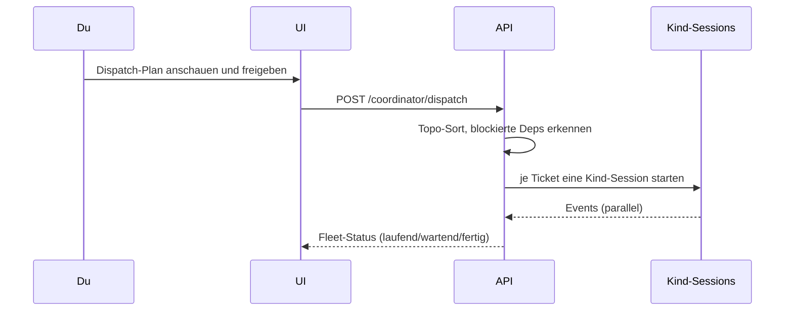
**Abhängigkeiten:** PROJ-1, PROJ-3, PROJ-4, PROJ-2, PROJ-9.

### PROJ-23 — Cross-Agent-Review / Challenge
Spawnt eine adversarielle Reviewer-Session (gleiche oder andere Engine). Findings kommen als strukturierte Karten; Nutzer nimmt pro Finding an/ab/kommentiert. Audit-Trail im Vault.

**Backend:**
| METHOD | Pfad | Service |
|---|---|---|
| POST | `/sessions/{id}/challenge` | `ChallengeService.start()` |
| GET | `/sessions/{id}/reviews` | `ChallengeService.get_review()` |
| GET | `/reviews/{review_id}` | `ChallengeService.get_review()` |
| POST | `/reviews/{review_id}/findings/{finding_id}` | `ChallengeService.resolve_finding()` |

**Schemas:** `ChallengeRequest`, `FindingRead`, `ReviewRead`, `FindingDecision` — `schemas/challenge.py`.
**Frontend:** `challenge-dialog.tsx`, `reviews-panel.tsx`, `review-finding.tsx`.
**Abhängigkeiten:** PROJ-18, PROJ-22, PROJ-4, PROJ-2.

### PROJ-24 — Vault als geteilter Dienst
Versionate `/vault/v1`-API mit Consumer-Key-Auth (`consumers.yaml`: id, key, read_paths, write_paths). Externe Dienste (Paperclip, Wayland) lesen/schreiben den Vault mit gescoppten Keys.

**Backend:**
| METHOD | Pfad | Auth |
|---|---|---|
| GET | `/vault/v1/read` | Consumer-Key |
| GET | `/vault/v1/search` | Consumer-Key |
| POST | `/vault/v1/write` | Consumer-Key |

**Schemas:** `VaultV1Pointer`, `VaultV1Read/Write/Search` — `schemas/vault_v1.py`.
**Service:** `engine/vault.py` + `engine/consumers.py` (`ConsumersRegistry`).
**Abhängigkeiten:** PROJ-2, PROJ-15, PROJ-18.

### PROJ-25 — Auth (JWT)
Echter Login mit JWT HS256. `AuthService` verwaltet Bootstrap, Login, Refresh (httpOnly-Cookie), Logout (Token-Revokierung in DB) und `get_current_user`-Dependency.

**Backend:**
| METHOD | Pfad | Zweck |
|---|---|---|
| GET | `/auth/status` | Bootstrap-Check (erster Start?) |
| POST | `/auth/bootstrap` | Ersten Account anlegen |
| POST | `/auth/login` | Access + Refresh-Token |
| POST | `/auth/refresh` | Token verlängern |
| POST | `/auth/logout` | Refresh revokieren |
| GET | `/auth/me` | Aktuellen User |

**Schemas:** `LoginRequest`, `TokenResponse`, `AuthStatus`, `UserPublic` — `schemas/auth.py`.
**Daten:** `users`, `refresh_token_registry` (SQLite).
**Frontend:** `/login`-Seite, `login-form.tsx`, `user-menu.tsx`.
**Abhängigkeiten:** PROJ-2, PROJ-24.

### PROJ-26 — Marktplatz / Registry
Zwei-stufiger Import (Preview → Confirm) für `.jupkg`-Pakete (Rollen, Skills, Agenten). `RegistryStore` verwaltet Katalog, Install, Activate, Rollback.

**Backend:**
| METHOD | Pfad | Zweck |
|---|---|---|
| GET | `/registry/catalog` | Alle Einträge (grupiert) |
| POST | `/registry/import` | Preview eines .jupkg |
| POST | `/registry/import/confirm` | Import bestätigen |
| GET | `/registry/{typ}/{id}` | Detail |
| POST | `/registry/{typ}/{id}/install` | Installieren |
| POST | `/registry/{typ}/{id}/activate` | Aktivieren |

**Schemas:** `RegistryCatalogRead`, `RegistryEntryRead/DetailRead`, `RegistryImportPreviewRead` — `schemas/registry.py`.
**Frontend:** `(cockpit)/apps/[key]/page.tsx`, `registry-control.tsx`.
**Abhängigkeiten:** PROJ-6, PROJ-1, PROJ-10, PROJ-25.

### PROJ-27 — Liveness-Indikator + Auto-Reanimierung
`LivenessMonitor` kombiniert Watchdog-Progress-Timeout + PID-Check. Auto-Reanimierung mit Attempt-Limit + Backoff-Gate (PROJ-45). Während Tool-in-Flight erhöhte Geduld (PROJ-32 Signal).

**Backend:** `GET/PATCH /settings/liveness`. Service: `engine/liveness.py`. Config: `liveness.yaml`.
**Schemas:** `LivenessConfig` (progress_timeout, tool_in_flight_timeout, poll_interval, max_auto_attempts, backoff_seconds).
**Frontend:** `liveness-control.tsx`, `heartbeat-dot.tsx`, `reanimate-button.tsx`.
**Ablauf:**
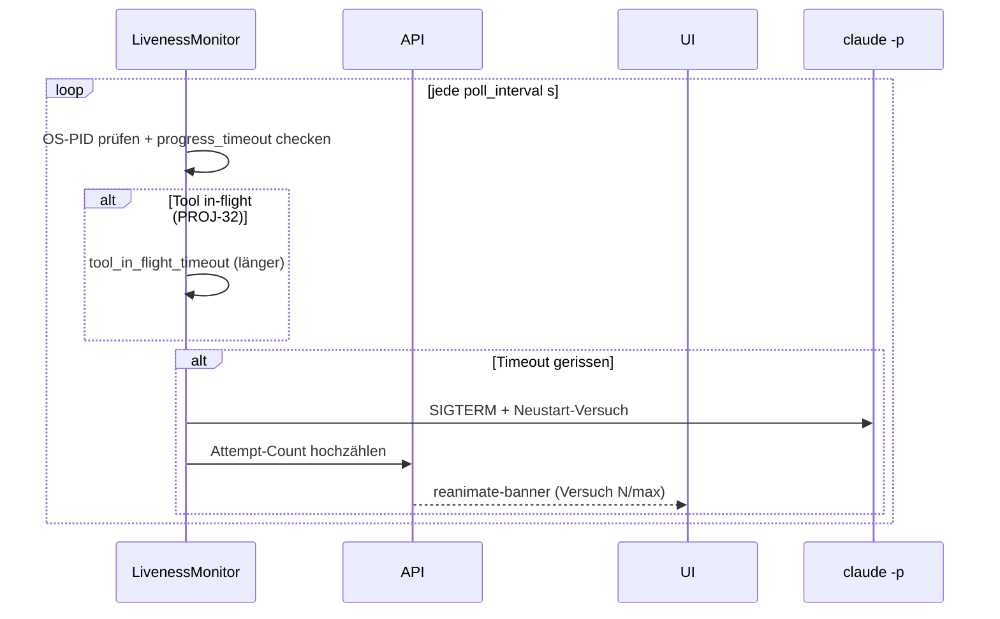
**Abhängigkeiten:** PROJ-1, PROJ-4, PROJ-10, PROJ-25.

### PROJ-28 — Fileexplorer Drei-Spalten-Layout
Drei-Spalten-Layout (`Sidebar · Panel · Ansicht`) für den Fileexplorer. Responsive Collapse bei schmaler Ansicht (Panel ⇄ Ansicht-Toggle). Spiegelt das Doku-Reader-Muster.

**Frontend:** `file-explorer.tsx`, `file-tree.tsx`, `file-preview.tsx` in `(cockpit)/dateien/page.tsx`.
**Abhängigkeiten:** PROJ-11, PROJ-7.

### PROJ-29 — Eingabefeld-Höhe symmetrisch
Auto-expandierendes Textarea im Session-Eingabefeld, Höhe abgestimmt auf die Aktions-Buttons (PROJ-36). Rein visueller Fix.

**Frontend:** Session-Eingabebereich in `sessions/[id]/page.tsx`.
**Abhängigkeiten:** PROJ-3, PROJ-11.

### PROJ-30 — Kanban-Phasenerkennung im Bypass-Mode
`derive_phase()` / `derive_phase_prospective()` in `SessionManager` machen die Phasenerkennung zustandslos und monoton — kein Revert. Im `bypassPermissions`-Modus laufen alle Skills ohne Phasen-Gate, Phase wird trotzdem beobachtet.

**Backend:** `engine/manager.py` (`derive_phase`). Kein Extra-Endpoint.
**Frontend:** `gantt-chart.tsx`, `kanban-board.tsx`.
**Abhängigkeiten:** PROJ-8, PROJ-1.

### PROJ-31 — MD-Reader Spec-Links auflösen
Wikilinks (`[[PROJ-X…]]`) in MD-Dateien werden im Reader aufgelöst und navigieren zur richtigen Datei statt ins Leere. Backlinks-Panel zeigt Querverweise.

**Backend:** `GET /md/backlinks?path=`. Service: `engine/md_reader.py` (Link-Resolver).
**Frontend:** `markdown-view.tsx` (Link-Handler), `backlinks-panel.tsx`.
**Abhängigkeiten:** PROJ-7, PROJ-12.

### PROJ-32 — Fortschritts-Signal aus Tool-Aktivität
Bei jedem Tool-Start/-Ergebnis wird ein `kind:"activity"`-Event über WebSocket gebroadcastet (`tool`, `target`, `timestamp`, `snippet`). Setzt das `tool_in_flight`-Flag im `WatchdogMonitor` → erhöhte Liveness-Geduld (PROJ-27).

**Backend:** Broadcast in `routes/sessions.py`; Flag in `engine/watchdog.py`.
**Frontend:** `activity-ticker.tsx`, `heartbeat-dot.tsx`.
**Abhängigkeiten:** PROJ-16, PROJ-27, PROJ-4.

### PROJ-33 — Session-Lifecycle-Härtung (Drain + Restart-Resilienz)
Ordentliches Shutdown: `drain_sessions()` markiert Sessions mit `drained_at`-Timestamp. Beim Start: `resume_drained_sessions()` startet automatisch neu. Erkennt Self-Restart via Command-Vergleich.

**Backend:** lifespan-Handler in `main.py`; `SessionManager.drain/resume_drained_sessions()`. Neues SQLite-Feld `drained_at`.
**Frontend:** `recovery-banner.tsx` (zeigt Drain-Grund).
**Abhängigkeiten:** PROJ-1, PROJ-14, PROJ-27, PROJ-17.

### PROJ-34 — Chat-Modus im Neue-Session-Dialog
Optionaler `chat_mode` beim Session-Start (SessionCreate-Feld). Reine UI-Präferenz: schaltet von ABC-Workflow-Kontext auf freies Chatfenster um.

**Backend:** `SessionCreate.chat_mode` (optional). Kein Backend-Verhalten.
**Frontend:** `new-session-dialog.tsx` (Modus-Toggle).
**Abhängigkeiten:** PROJ-3, PROJ-9, PROJ-1.

### PROJ-35 — Session-Titel = Projektname
`displayName()`-Utility leitet den Session-Titel aus dem `project_path`-Basename ab. Nutzer kann bei Erstellung überschreiben. `session_index` speichert `title`.

**Backend:** `SessionRead.title` (DB-Feld + Ableitung). Service: `engine/manager.py`.
**Frontend:** `session-tile.tsx`, `session-rail.tsx`.
**Abhängigkeiten:** PROJ-3, PROJ-9.

### PROJ-36 — Eingabe-Buttons auf drei Reihen
Drei-Reihen-Button-Layout im Session-Eingabebereich: Reihe 1 = Senden (volle Breite), Reihen 2–3 = Aktions-Buttons (Mikro, Büroklammer, Stop). Symmetrie mit PROJ-29.

**Frontend:** `sessions/[id]/page.tsx` (Button-Layout).
**Abhängigkeiten:** PROJ-3, PROJ-20, PROJ-11, PROJ-29.

### PROJ-37 — Fileexplorer: aktives Fenster bleibt
Beim Navigieren zwischen Dateien im Fileexplorer bleibt die zuletzt fokussierte Session/Datei erhalten (statt leeres Vorschaufenster). Gespeichert in `localStorage` (reload-stabil).

**Frontend:** `sessions-provider.tsx`, `file-explorer.tsx`. Persistenz: `localStorage`.
**Abhängigkeiten:** PROJ-28, PROJ-11, PROJ-3.

### PROJ-38 — Sidebar-Sektionen + Konfig-Panel
Sidebar (Session-Rail) ist in konfigurierbare Sektionen unterteilt: Workspace, Sessions, Orchestration, Micro-Apps. Sichtbarkeit und Reihenfolge per Drag-and-Drop. Prefs in `localStorage`. Workspace-Header immer sichtbar.

**Frontend:** `session-rail.tsx`, `sidebar-config-panel.tsx`, `sidebar-prefs-provider.tsx`.
**Abhängigkeiten:** PROJ-3.

### PROJ-39 — Sidebar-Sektion „Orchestration" — iFrame-Apps
Registry-Einträge mit `group:"orchestration"` erscheinen in der Orchestration-Sektion der Sidebar. Klick öffnet die App in einem vollflächigen `embed-tab.tsx` (iFrame).

**Backend:** `GET /registry/catalog` filtert nach `group`.
**Frontend:** `session-rail.tsx`, `embed-tab.tsx`, `use-orchestration-apps.tsx`. Route: `(cockpit)/orchestration/[key]/page.tsx`.
**Abhängigkeiten:** PROJ-38, PROJ-3, PROJ-18.

### PROJ-40 — Sidebar-Sektion „Micro-Apps" + Excalidraw-Migration
Registry-Einträge mit `group:"micro"` (kind: `native` = clientseitig; `web` = iFrame). Status-Polling für Apps mit Health-Endpoint.

**Backend:** `GET /registry/catalog` (native + embedded).
**Frontend:** `use-microapps.tsx`, `use-microapp-status.tsx`, `embed-tab.tsx`. Route: `(cockpit)/apps/[key]/page.tsx`.
**Abhängigkeiten:** PROJ-38, PROJ-3, PROJ-18.

### PROJ-41 — Video Summary (Micro-App)
Queue-basierter Worker: URLs einreihen → `VideoSummaryWorker` transkribiert + fasst zusammen via `hal-video-summary`-Skill → Ergebnis im Hal-Vault. Modell-Wahl persistent (PROJ-44).

**Backend:**
| METHOD | Pfad | Service |
|---|---|---|
| GET | `/video-summary/queue` | Worker.queue |
| POST | `/video-summary/queue` | `QueueAddRequest` → Worker.add() |
| DELETE | `/video-summary/queue/{id}` | Worker.remove() |
| POST | `/video-summary/run-now` | Worker.trigger() |
| GET/PATCH | `/video-summary/settings` | Modell-Wahl, Standard-Ordner |
| GET | `/video-summary/library` | Library-Scan |

**Daten:** `video_summary_queue` (SQLite); Output-Pfad im Vault.
**Frontend:** Micro-App in `(cockpit)/apps/video-summary/`.
**Abhängigkeiten:** PROJ-40, PROJ-1, PROJ-2.

### PROJ-42 — VPS-Admin Dashboard (Micro-App)
Read-only In-Memory-Snapshot: CPU/RAM/Disk/Load als Traffic-Light (green/amber/red). Cached per Tick, nicht per Request. Schwellen konfigurierbar in `config.py`.

**Backend:** `GET /metrics/current`, `GET /metrics/status`. Service: `engine/metrics.py`.
**Schemas:** `MetricsSnapshot`, `MetricsStatus`.
**Frontend:** `ampel.tsx`, Metrics-Dashboard in Micro-App oder Sidebar.
**Abhängigkeiten:** PROJ-40, PROJ-3.

### PROJ-43 — VPS-Admin Terminal (iFrame ttyd)
TCP-Probe prüft, ob ttyd erreichbar ist. Ergebnis in `TerminalInfo.reachable`. Bei Erreichbarkeit: ttyd-URL in `embed-tab.tsx` eingebettet; sonst: „Terminal nicht verfügbar"-Meldung.

**Backend:** `GET /terminal/info` → TCP-Probe. Config: `terminal_url`, `host`, `port`.
**Frontend:** `embed-tab.tsx`. Route: `(cockpit)/orchestration/terminal/page.tsx`.
**Abhängigkeiten:** PROJ-42, PROJ-40, PROJ-3.

### PROJ-44 — Video Summary — Standard-Ordner + Modellwahl
Ergänzung zu PROJ-41: fester Output-Ordner (relativ zu Vault/Projekt-Root) statt Auto-Kategorisierung; Modell-Wahl persistent in `video_summary_model`-Setting; Library-Scan auf Abruf.

**Backend:** `GET/PATCH /video-summary/settings` (`VideoSummarySettingsRead`). Config: `video_summary_default_folder`.
**Frontend:** Settings-Panel in der Video-Summary-Micro-App.
**Abhängigkeiten:** PROJ-41, PROJ-2, PROJ-7.

### PROJ-45 — Auto-Reanimierungs-Budget (Endlosschleife-Fix)
Ergänzung zu PROJ-27: `max_auto_attempts` (Default 2) und `backoff_seconds` deckeln die Auto-Reanimierung. Nach Erschöpfen des Budgets: nur manuelle Reanimierung möglich. PROJ-45-Hysterese: `tool_in_flight`-Flag wird nach Resume-Start **nicht** sofort gecleart (verhindert Frühzündung).

**Backend:** `LivenessMonitor` (attempt_count, backoff_gate). Config: `liveness.yaml`.
**Frontend:** `reanimate-button.tsx` (zeigt Verbleibende Versuche).
**Abhängigkeiten:** PROJ-27, PROJ-32, PROJ-16.

### PROJ-46 — Live-Aktivitäts-Ticker (Bypass-Mode)
Transientes Tool-Aktivitäts-Signal (`kind:"activity"` auf WS): Tool-Name, Ziel, Timestamp, Text-Snippet. Kollabierbar im UI. Ergänzt den Heartbeat mit „was macht er gerade?".

**Backend:** Broadcast in `routes/sessions.py` / `engine/manager.py`. Kein REST-Pull.
**Frontend:** `activity-ticker.tsx` in `sessions/[id]/page.tsx`.
**Ablauf:**
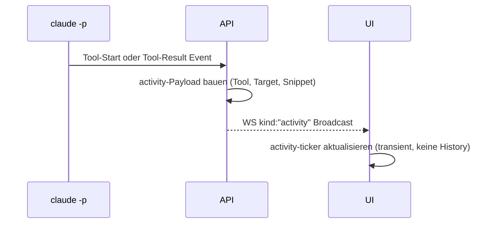
**Abhängigkeiten:** PROJ-4, PROJ-1, PROJ-3, PROJ-27.

### PROJ-47 — Stream-Reader-Stall (verwaister Subprozess)
`stream_reader_line_limit_bytes` in `config.py` begrenzt den stdout-Puffer. Überschreitet ein Tool-Output das Limit, bricht der Reader kontrolliert ab, statt die Session einzufrieren. Verhindert verwaiste Subprozesse und frozen UI.

**Backend:** Limit-Check in `engine/watchdog.py` / `config.py`.
**Kein Frontend-Eingriff** (automatischer Schutz).
**Abhängigkeiten:** PROJ-1, PROJ-14, PROJ-27.

### PROJ-49 — WebSocket-Flapping — Stabilität + Event-Replay
Periodic Keepalive-Ping (25 s, `_WS_PING_INTERVAL_S`) verhindert Proxy-Idle-Timeout. Bei (Re-)Connect: **Full-Snapshot** (komplettes Transkript + Zustand) statt Event-Replay → verlustfreies Resync. Frontend-Hook reconnectet automatisch.

**Backend:** Ping-Loop + Snapshot-Serialisierung in `routes/sessions.py` / `engine/manager.py`.
**WS-Contract:** `kind: "state"` (Snapshot) | `kind: "message"` (Delta) | `kind: "ping"`.
**Frontend:** `useSessionStream`-Hook in `sessions/[id]/page.tsx`.
**Ablauf:**
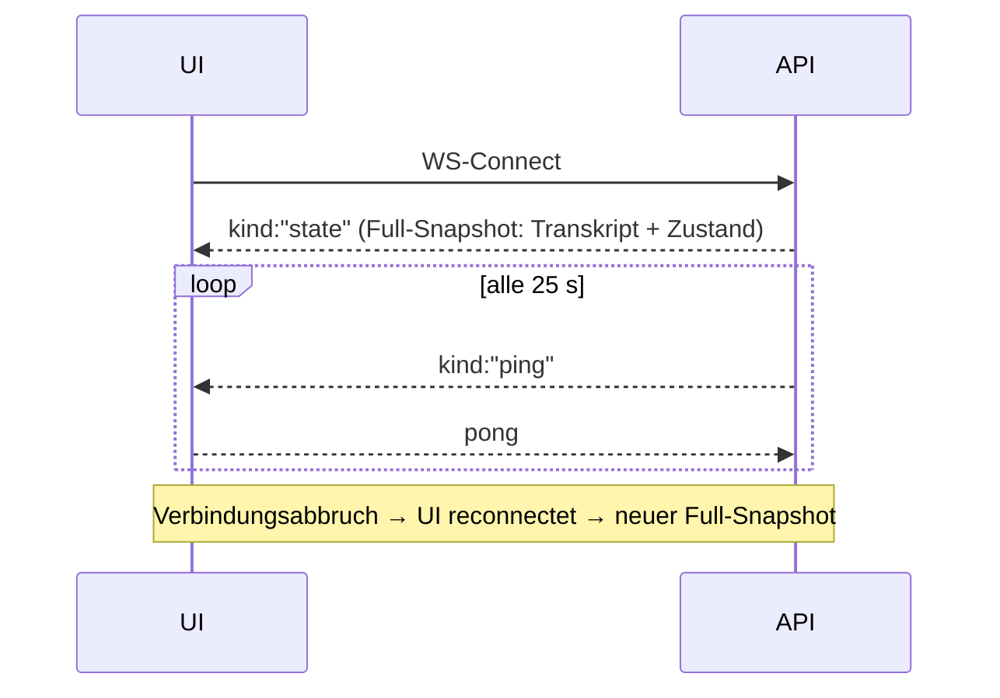
**Abhängigkeiten:** PROJ-3, PROJ-1, PROJ-25.

## 7. Cross-Cutting Concerns

- **Auth-Pipeline:** Alle Cockpit-Routen hinter `Depends(get_current_user)` (JWT, PROJ-25). `/internal/permission` ist localhost-only; `/vault/v1` ist consumer-key-geschützt (PROJ-24).
- **Dateien (kein MinIO):** Up-/Download direkt gegen host-natives Dateisystem, **gestreamt**. Zentrale Schutzgrenze = `realpath`-Scope auf `allowed_roots`.
- **Live-Reload-Config:** `policy.yaml`, `watchdog.yaml`, `liveness.yaml`, `engines.yaml` und Konstitutions-MD per **mtime-Watch** ohne Neustart; fehlt/defekt → konservative Defaults + Warnung (nie „kein Schutz").
- **WebSocket-Stabilität:** Keepalive-Ping (25 s, PROJ-49) + Full-Snapshot bei Connect; Frontend reconnectet automatisch; Polling (4 s) als Fallback.
- **Freigabe-Pipeline (Reihenfolge in `request_decision`):** Phasen-Detektion (PROJ-8) → Watchdog-Alarm (PROJ-16, sticht Bypass) → Phasen-Gate (PROJ-10) → Policy-Evaluator (PROJ-10) → Decision Card (PROJ-4) | auto-allow | deny.
- **Liveness-Pipeline:** LivenessMonitor (PROJ-27) + Tool-in-Flight-Flag (PROJ-32) + Reanimierungs-Budget (PROJ-45) + Drain/Resume (PROJ-33).
- **Error-Handling:** Persistenz/Vault-Operationen **best-effort** — bei Fehler führt der In-Memory-Pfad, Nutzer sieht Warnung. OS-Fehler gemappt (`PermissionError`→403, `OSError`→400).
- **Restart-Resilienz:** lifespan → `init()` → `rehydrate()` → `resume_drained_sessions()` (PROJ-33); aktive, nicht steuerbare Sessions → verwaist (PROJ-14); Recovery-Kandidaten (PROJ-17).
- **Hot-Path-Schonung:** SQLite-Writes nur bei Statuswechsel off-thread (`asyncio.to_thread`, WAL); Watchdog-Fenster O(1); Metrics cached per Tick (PROJ-42).
- **Registry-Sicherheit (PROJ-26):** Zwei-stufiger Import (Preview → Confirm); Capabilities + Policies validiert vor Activation; `owner` aus JWT.

## 8. Funktions-Beziehungen

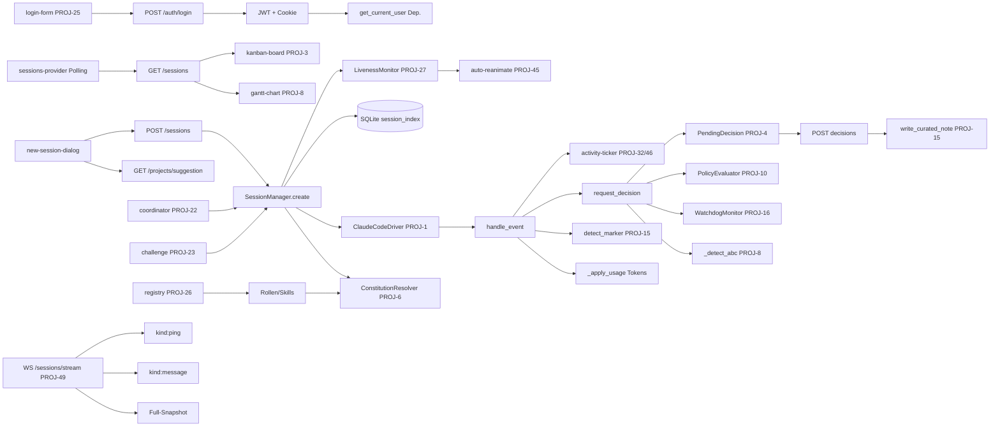
