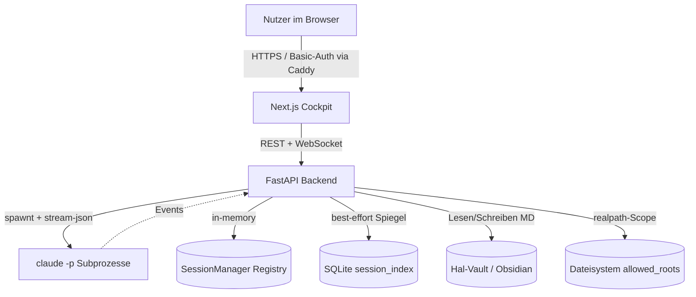
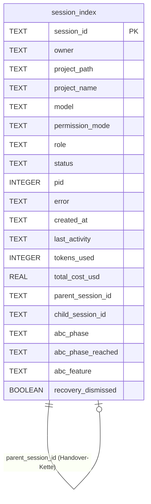
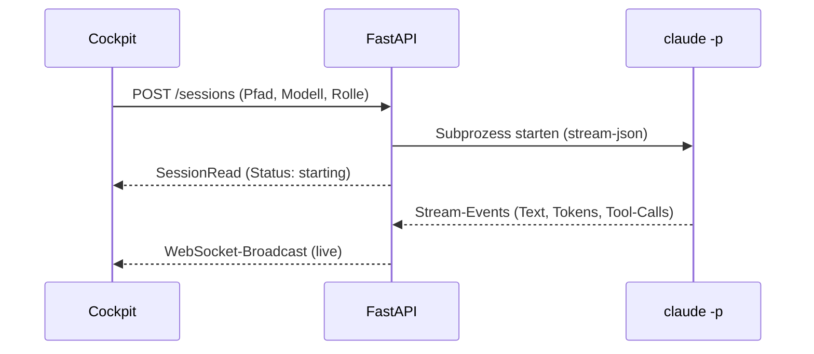
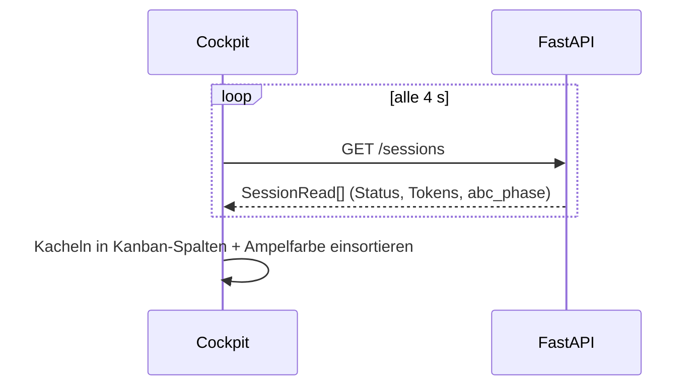
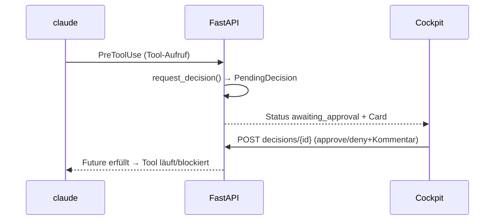
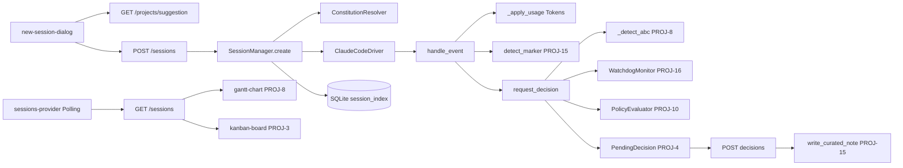

# Technische Architektur

> **Stand:** 2026-06-24 · Lebende Doku, generiert aus `features/INDEX.md` + Code. Dokumentiert sind die nicht-`Planned`-Features (PROJ-1–12, 14–18, 21).
> **Jupiter-Override:** Next.js statt Flutter · FastAPI **in-memory + SQLite** statt Neon/ORM · **kein** MinIO (Dateien host-nativ) · **kein** JWT/RLS (Single-User-MVP).

## 1. System-Überblick

Jupiter ist eine **selbstgehostete Kommandozentrale**, die mehrere **Claude-Code-Headless-Sessions** (`claude -p --output-format stream-json`) als überwachbare Flotte orchestriert. Das **Cockpit** (Next.js) zeigt Sessions als Kanban-/Ampel-Kacheln und einen ABC-Workflow-Gantt; das **Backend** (FastAPI) startet/steuert die Claude-Subprozesse, hält ihren Live-Zustand **in-memory**, spiegelt ihn best-effort in einen **SQLite-Live-Index** (Restart-Resilienz) und schreibt lesbare Artefakte in den **Hal-Vault** (Obsidian-Markdown) als persistente Wahrheit. An Schaltstellen pausiert eine Session und erzeugt eine **Decision Card**, die der Nutzer freigibt.

## 2. Tech-Stack

- **Frontend:** Next.js 16 (App Router), React, TypeScript, Tailwind CSS, shadcn/ui. State über React-Provider/Hooks (`sessions-provider.tsx`), kein Riverpod. Polling (4 s) + WebSocket pro Session.
- **Backend:** FastAPI (Python 3.11+, Conda-Env `Dashboard`), Pydantic v2. **Kein ORM** — Zustand in-memory (`SessionManager`), Persistenz via stdlib `sqlite3` (WAL, off-thread).
- **Engine:** Claude Code headless (`claude -p`, Stream-JSON, Subscription-Auth, **kein** API-Key), Modell-Routing via `--model`, Konstitution via `--append-system-prompt`, Freigaben via `--permission-prompt-tool`.
- **Persistenz:** SQLite-Live-Index (`~/jupiter-data/session_index.db`) — schneller Spiegel, **nicht** die Wahrheit.
- **Wahrheit:** Hal-Vault (`/home/dev/tools/Hal`, Obsidian/PARA, offenes Markdown).
- **Dateien:** host-natives Dateisystem innerhalb `allowed_roots` (kein Object-Storage).
- **Config (live-reload):** YAML-Dateien mit mtime-Watch — `policy.yaml` (PROJ-10), `watchdog.yaml` (PROJ-16), Konstitutions-MD (PROJ-6).
- **Deploy:** host-nativ auf Dev-VPS (systemd `jupiter-backend`/`-frontend`, Caddy-TLS, GitHub-Webhook Auto-Deploy auf `jupiter.auxevo.tech`).

## 3. Datenmodell

Jupiter hat **kein relationales Schema im klassischen Sinn**. Es gibt drei Speicher-Ebenen:

1. **In-Memory (Wahrheit des Live-Zustands):** `SessionManager._sessions: dict[str, SessionRuntime]` mit `SessionState` (Status, Tokens, pending Decisions, Watchdog-Monitor, abc_phase …).
2. **SQLite-Live-Index (Restart-Spiegel):** eine Tabelle `session_index`.
3. **Vault + Dateisystem (persistente Wahrheit / Artefakte):** Markdown-Logs, Handovers, kuratiertes Wissen; beliebige Dateien.

- **Index:** `idx_session_index_status` auf `status` → schnelle Aktiv-Zählung (Limit, PROJ-14) und Reconcile/Recovery (PROJ-17).
- **Kein `mandant_id`, keine RLS** — Single-User. Jedes Artefakt trägt nur ein `owner`-Feld (heute konstant), damit eine spätere Team-Migration (PROJ-25) billig bleibt.

## 4. Auth & „Multi-Tenancy"

> **Bewusster Override:** Jupiter ist ein **Single-User-MVP** — **kein** JWT, **keine** RLS, **keine** Mandanten-Isolation.

- **Zugang:** Die App liegt hinter **Caddy** (TLS + HTTP-Basic-Auth) und/oder Tailscale. Authentifizierung passiert am Reverse-Proxy, nicht in FastAPI.
- **Interne Endpunkte:** Der Permission-Callback (`/internal/permission`, vom `--permission-prompt-tool` aufgerufen) ist **token-/localhost-geschützt** — kein Zugriff von außen.
- **Pfad-Sicherheit statt Tenant-Isolation:** Da kein RLS existiert, ist die zentrale Schutzgrenze die **`realpath`-Scope-Prüfung** gegen `allowed_roots` (`/home/dev/projects`, `/home/dev/tools`). Jeder Datei-/Vault-/MD-Zugriff wird normalisiert und abgelehnt, wenn er aus den Roots ausbricht (Traversal/Symlink).
- **`owner`-Feld:** überall mitgeführt, heute konstant — Vorbereitung für echtes Auth (PROJ-25).

## 5. Routing & Navigation

**Next.js-Routen** (`app/(cockpit)/`):

| Route | Screen | Zweck |
|---|---|---|
| `/` | `page.tsx` | Mission Control: Kanban + Ampel-Kacheln + ABC-Gantt |
| `/sessions/[id]` | `sessions/[id]/page.tsx` | Session-Detail: Transkript, Eingabe, Decision Cards |
| `/doku` | `doku/page.tsx` | MD-Reader + MD-Editor (Vault & Projekt) |
| `/dateien` | `dateien/page.tsx` | Fileexplorer + Clipboard |
| `(layout)` | `layout.tsx` | Shell (`CockpitShell`): `SessionRail` links + Inhalt rechts |

**FastAPI-Router** (`backend/app/routes/`, Prefixe):

| Prefix | Router | Features |
|---|---|---|
| `/sessions`, `/recovery` | `sessions.py` | PROJ-1, 3, 4, 5, 14, 17, 21 |
| `/vault` | `vault.py` | PROJ-2, 15 |
| `/md` | `md.py` | PROJ-7, 12 |
| `/constitution` | `constitution.py` | PROJ-6 |
| `/files` | `files.py` | PROJ-11 |
| `/settings` | `settings.py` | PROJ-5 (threshold), 10 (policy), 16 (watchdog) |
| `/projects` | `projects.py` | PROJ-9 |
| `WS /sessions/{id}` | `sessions.py` | PROJ-1 (Live-Stream) |

## 6. Features

### PROJ-1 — Engine-Treiber (Claude headless)
Startet und steuert Claude-Code-Subprozesse headless. `ClaudeCodeDriver` spawnt `claude -p --output-format stream-json`, parst den Event-Stream (Tokens/Kosten aus `result`-Events), und hält je Session eine `SessionRuntime` in-memory. Der Live-Stream wird per WebSocket ans Cockpit gebroadcastet.

**Backend:**
| METHOD | Pfad | Schema-In | Schema-Out | Service |
|---|---|---|---|---|
| POST | `/sessions` | `SessionCreate` | `SessionRead` | `SessionManager.create()` |
| GET | `/sessions` / `/sessions/{id}` | — | `SessionRead`/`SessionDetail` | `SessionManager.list/get` |
| POST | `/sessions/{id}/input` | `SessionInput` | `SessionRead` | `SessionRuntime.send_input()` |
| POST | `/sessions/{id}/stop` | — | `SessionRead` | `SessionRuntime.stop()` |
| WS | `/sessions/{id}` | — | Event-Stream | `ClaudeCodeDriver.read_stream()` |

**Frontend:** `sessions/[id]/page.tsx` (Detail), `session-tile.tsx`, `context-gauge.tsx`; State: `sessions-provider.tsx` (Polling) + WebSocket-Hook.
**Daten:** in-memory `SessionRuntime`; gespiegelt nach `session_index` (PROJ-14).
**Ablauf:**

**Abhängigkeiten:** keine.

### PROJ-2 — Vault-Anbindung
Liest/schreibt/sucht Markdown im Hal-Vault als persistente Wahrheit. `VaultService` schreibt **atomar** (temp + `os.replace`), parst YAML-Frontmatter und vergibt Slugs; bei Namenskollision `append`/`version`.

**Backend:**
| METHOD | Pfad | Out | Service |
|---|---|---|---|
| GET | `/vault/files?dir=` | `VaultFile[]` | `VaultService.list()` |
| GET | `/vault/file?path=` | `VaultFileRead` | `VaultService.read()` |
| GET | `/vault/search?q=` | `VaultSearchResult[]` | `VaultService.search()` |
| POST | `/vault/files` | `VaultFile` | `VaultService.write()` |

**Daten:** `/home/dev/tools/Hal/Agentic OS/Jupiter/` (`Sessions/`, `Handovers/`, `Knowledge/`).
**Abhängigkeiten:** keine.

### PROJ-3 — Cockpit (Mission Control / Kanban / Ampel)
Die zentrale Übersicht: Sessions als Ampel-Kacheln, gruppiert in einem Kanban (Arbeitet / Wartet / Review / Fertig), darunter der ABC-Gantt (PROJ-8). Status wird aus dem Engine-Zustand abgeleitet.

**Frontend:** `app/(cockpit)/page.tsx`; Komponenten `session-tile.tsx`, `kanban-board.tsx`, `global-status-bar.tsx`, `session-rail.tsx`, `new-session-dialog.tsx`. State: `sessions-provider.tsx`.
**Backend:** `GET /sessions` (Status-Enum starting/running/waiting/awaiting_approval/done/error).
**Ablauf:**

**Abhängigkeiten:** PROJ-1, PROJ-2.

### PROJ-4 — Decision Cards (Freigabe-Flow)
An jedem Tool-Aufruf läuft die Session durch `request_decision()`. Je nach Policy entsteht eine **Decision Card** (in-memory `PendingDecision` + blockierende `asyncio.Future`); der Nutzer gibt frei, lehnt ab oder schickt einen Kommentar zurück.

**Backend:** `POST /sessions/{id}/decisions/{decision_id}` (`DecisionResolve`: approve/deny/comment). Hook `request_decision()` im Event-Pfad.
**Frontend:** `decision-card.tsx` (Was/Warum/Ausschnitt + Aktionen), `confirm-dialog.tsx`.
**Ablauf:**

**Abhängigkeiten:** PROJ-1, PROJ-3.

### PROJ-5 — Context-Management & Handover
Hält den Kontext-Füllstand sichtbar (`context-gauge`) und warnt an konfigurierbarer Schwelle. Bei Bedarf erzeugt der Nutzer ein **Handover** (Staffelstab-MD im Vault) und setzt die Session zurück → neue Kind-Session mit Seed-Kontext (`parent_session_id`).

**Backend:** `POST /sessions/{id}/handover/generate` + `/handover`, `POST /sessions/{id}/reset`, `PATCH /sessions/{id}/threshold`, `GET /settings/threshold`. Service: `engine/handover.py`, `SessionManager.reset()`.
**Frontend:** `handover-dialog.tsx`, `reset-session-button.tsx`, `threshold-badge.tsx`, `threshold-control.tsx`.
**Daten:** Handover-MD im Vault (`Handovers/`); in-memory `threshold_override_pct`, `parent_session_id`.
**Abhängigkeiten:** PROJ-1, PROJ-2, PROJ-3.

### PROJ-6 — Knappheits-Konstitution
Injiziert eine token-sparsame Konstitution + Rolle in jede Session via `--append-system-prompt`. `ConstitutionResolver` setzt `global.md` + `roles/<rolle>.md` zusammen (append/replace über Marker), mit Regex-Guard gegen ungültige Rollennamen.

**Backend:** `GET /constitution`, `GET /constitution/{role}`, `GET /sessions/{id}/constitution`. Service: `engine/constitution.py`.
**Daten:** `backend/constitution/global.md`, `backend/constitution/roles/*.md` (Default `architect.md`); in-memory `role`, `effective_constitution`, `constitution_source`.
**Abhängigkeiten:** PROJ-1.

### PROJ-7 — MD-Reader
Read-only-Browser für Markdown aus Vault **und** Projekt-Roots. `MdReaderService` listet Quellen/Dateien und liefert Frontmatter + Body; alle Pfade `realpath`-scoped. Frontend rendert mit react-markdown + GFM, Navigation per Datei-Baum und (interne) Wikilinks.

**Backend:** `GET /md/sources`, `GET /md/index?source=`, `GET /md/file?path=`. Service: `engine/md_reader.py`.
**Frontend:** `app/(cockpit)/doku/page.tsx`; `file-tree.tsx`, `markdown-view.tsx`. State: URL-Params `?source=&path=`.
**Abhängigkeiten:** PROJ-2.

### PROJ-8 — ABC-Workflow-Gantt
Zeigt unter dem Kanban je Session den Fortschritt durch die 8 ABC-Phasen. `_detect_abc()` erkennt aus den Events den zuletzt aufgerufenen `abc-*`-Skill → `abc_phase`/`abc_phase_reached`/`abc_feature`. Reine gepollte Lese-Ansicht (kein Extra-Request).

**Backend:** `GET /sessions` (+ vier Felder). Service: `engine/abc_phases.py` (`SKILL_TO_PHASE`, `max_phase`, `detect_phase_signal`).
**Frontend:** `gantt-chart.tsx` (8-Spalten-Grid), Version-Badge in `session-rail.tsx`/`cockpit-shell.tsx`.
**Daten:** in-memory + `session_index.abc_*`.
**Abhängigkeiten:** PROJ-3, PROJ-1, PROJ-6.
> **Bekannte Schwäche:** Im `bypassPermissions`-Modus werden späte Phasen (QA/Deploy) nicht zuverlässig erkannt — Fix geplant als **PROJ-30**.

### PROJ-9 — Smart Launcher
Beim Session-Start liest `LauncherService` die `features/INDEX.md` des gewählten Projekts, ermittelt das reifste fortsetzbare Feature, die nächste Phase, den passenden `abc-*`-Skill und ein Modell — als überschreibbarer Vorschlag im Dialog.

**Backend:** `GET /projects/suggestion?project_path=`. Service: `engine/launcher.py`.
**Frontend:** `new-session-dialog.tsx` (Vorschlag-Card). Daten: `features/INDEX.md` (Datei-Read).
**Abhängigkeiten:** PROJ-3, PROJ-1, PROJ-8.

### PROJ-10 — Trust-Policy + Phasen-Gate
Konfigurierbare, abgestufte Freigabe-Regeln. `PolicyEvaluator.evaluate(tool, context)` liefert `auto-allow | card | deny` über einen Spezifitäts-Matcher (Tool+Rolle+Skill+Projekt > … > Default). Zusätzlich ein **hartes Phasen-Gate** beim Phasenwechsel — greift auch im Bypass.

**Backend:** `GET/PUT /settings/policy`. Service: `engine/policy.py`. Config: `config/policy.yaml` (mtime-Live-Reload).
**Frontend:** `policy-control.tsx` (Regel-Editor) im `settings-dialog.tsx`.
**Abhängigkeiten:** PROJ-4, PROJ-8, PROJ-1.

### PROJ-11 — Fileexplorer + Clipboard
Zwei Oberflächen, ein `/files`-Backend: (A) ein vollständiger **Fileexplorer** (`/dateien`) und (B) ein **In-Session-Clipboard** (Button/Drop am Eingabefeld), das eine Datei in den Clipboard-Ordner lädt und ihren absoluten Pfad ins Eingabefeld einfügt. Streaming-Up-/Download, `realpath`-Scope, Zeitstempel-Namen für namenlose Pastes.

**Backend:**
| METHOD | Pfad | Service |
|---|---|---|
| GET | `/files/list?path=` | `FileService.list()` |
| GET | `/files/download?path=` | Stream (FileResponse) |
| POST | `/files/upload` (multipart) | `FileService.upload()` |
| POST | `/files/mkdir`/`rename`/`move`/`delete` | `FileService.*` |
| GET/PATCH | `/settings/clipboard-dir` | Clipboard-Pfad |

**Frontend:** `file-explorer.tsx`, `session-clipboard-button.tsx`, `use-file-upload.ts`.
**Daten:** Dateisystem in `allowed_roots`, Clipboard-Ordner (`/home/dev/projects/clipboard`).
**Abhängigkeiten:** PROJ-1, PROJ-3, PROJ-7.
> **Geplant:** Drei-Spalten-Layout (PROJ-28), Eingabefeld-Symmetrie (PROJ-29).

### PROJ-12 — MD-Editor (voll)
Erweitert den Reader um Bearbeiten: `GET /md/file` liefert zusätzlich `mtime`+`hash`; `POST /md/file` schreibt atomar mit **Konflikterkennung** (erwartete `mtime`/`hash`, sonst Force). `[[`-Autocomplete und ein Backlinks-Panel (welche Dateien verlinken hierher).

**Backend:** `GET /md/file` (+mtime/hash), `POST /md/file` (`MdSaveRequest`), `GET /md/backlinks?path=`.
**Frontend:** `md-editor.tsx`, `backlinks-panel.tsx`, `frontmatter-panel.tsx`.
**Abhängigkeiten:** PROJ-7, PROJ-2.
> **Bekannte Schwäche:** Relative MD→MD-Links navigieren teils ins Leere — Fix geplant als **PROJ-31**.

### PROJ-14 — Härtung: Limit + SQLite-Persistenz
Zwei Bausteine: (1) ein atomar geprüftes **Limit** gleichzeitig aktiver Sessions (`asyncio.Lock`, `SessionLimitError` → HTTP 429); (2) ein **SQLite-Live-Index**, der nur bei Statuswechseln off-thread spiegelt. Beim Start rehydriert `rehydrate()` die Liste; nicht mehr steuerbare Prozesse werden als **verwaist** markiert.

**Backend:** `GET /sessions/limits`. Service: `SessionManager.create()` (Limit) + `backend/app/db/` (`SessionIndexRepository`-Protocol, SQLite-Impl, Null-Impl).
**Daten:** `session_index.db` (Tabelle s. §3).
**Abhängigkeiten:** PROJ-1, PROJ-3.

### PROJ-15 — Vault Stufe 3 (Kuratierung)
Macht den Vault zum „lebenden Gehirn": `engine/curation.py` erkennt im Event-Stream Marker (gelöster Bug / ADR / Sackgasse) und schlägt — entprellt, nicht-blockierend — eine **kuratierte Notiz** als Decision Card (`card_type="knowledge_proposal"`) vor. Nach Freigabe landet sie in `Knowledge/`; durchsuchbar über `knowledge-search`.

**Backend:** `POST /vault/files` (type=curated), `GET /vault/search?scope=curated`, Knowledge-Proposal-Card im Decisions-Endpoint. Service: `engine/curation.py`, `vault.write_curated_note()`.
**Frontend:** `decision-card.tsx` (knowledge_proposal), `knowledge-search.tsx`.
**Abhängigkeiten:** PROJ-2, PROJ-4, PROJ-5.

### PROJ-16 — Amok-Watchdog
Reißleine gegen durchdrehende Sessions: `WatchdogMonitor` führt Schiebefenster für Tokens/Zeit, Schreibrate, Stillstand und identische Tool-Wiederholungen. Reißt ein Limit, wird der **nächste Tool-Call** in eine `watchdog_pause`-Card umgelenkt — **vor** dem Bypass-Auto-Allow, sticht also auto-allow. Fortsetzen resettet den Zähler + Cooldown.

**Backend:** `GET/PUT /settings/watchdog`. Service: `engine/watchdog.py` (`WatchdogStore` YAML + `WatchdogMonitor`). Config: `config/watchdog.yaml`.
**Frontend:** `watchdog-control.tsx`, `decision-card.tsx` (watchdog_pause).
**Defaults:** 200k Tokens/60 s · 180 s Stillstand · 5 identische Calls · 30 Writes/60 s.
**Abhängigkeiten:** PROJ-1, PROJ-4, PROJ-10.

### PROJ-17 — Recovery über Vault *(In Progress)*
Stellt verwaiste/abgebrochene Sessions wieder her. `get_recovery_candidates()` scannt SQLite (verwaiste Sessions ohne Kind) + Vault (Handovers/Logs), bewertet die Stärke (strong/medium/weak) und nutzt den Reset-Kind-Mechanismus (PROJ-5) zum Wiederbeleben. `recovery_dismissed` blendet Kandidaten aus.

**Backend:** `GET /recovery`, `POST /recovery/{id}/restore`, `POST /recovery/{id}/dismiss`.
**Frontend:** `recovery-banner.tsx`, `recovery-dialog.tsx`.
**Daten:** `session_index.recovery_dismissed` + Vault-Handovers.
**Abhängigkeiten:** PROJ-14, PROJ-5, PROJ-2.

### PROJ-18 — Weitere Engines + iFrame/Launch *(Architected)*
Abstrahiert den Treiber, sodass neben Claude weitere CLI-Engines laufen können. `GenericCliDriver` normalisiert je Adapter den Stream; `EngineRegistry` lädt `engines.yaml` (argv-Vorlage, Adapter, Modell-Whitelist). Nicht-Claude-Sessions degradieren claude-spezifische Felder (Kontext/Kosten → „n/v").

**Backend:** `SessionCreate.engine`. Service: `engine/generic_cli_driver.py`, `engine/registry.py`. Config: `config/engines.yaml`.
**Frontend:** `new-session-dialog.tsx` (Engine-Select).
**Abhängigkeiten:** PROJ-1, PROJ-9, PROJ-3.

### PROJ-21 — Session-Löschen / Aufräumen
Entfernt terminale Sessions (done/error/verwaist) aus Cockpit und Index. `delete()` prüft den Status (aktiv → 409), killt best-effort den OS-Prozess (SIGTERM auf gespeicherte PID) und löscht den SQLite-Eintrag. `cleanup_terminal()` macht das als Bulk.

**Backend:** `DELETE /sessions/{id}`, `POST /sessions/cleanup`. Service: `SessionManager.delete/cleanup_terminal`.
**Frontend:** `delete-session-button.tsx`, `cleanup-button.tsx`, `confirm-dialog.tsx`.
**Abhängigkeiten:** PROJ-1, PROJ-14, PROJ-3.

## 7. Cross-Cutting Concerns

- **Dateien (kein MinIO):** Up-/Download direkt gegen das host-native Dateisystem, **gestreamt** (kein Voll-RAM), Größenlimit + Extension-Whitelist. Zentrale Schutzgrenze = `realpath`-Scope auf `allowed_roots`.
- **Live-Reload-Config:** `policy.yaml`, `watchdog.yaml` und Konstitutions-MD werden per **mtime-Watch** ohne Neustart übernommen; fehlt/defekt → konservative Defaults + sichtbare Warnung (nie „kein Schutz").
- **Error-Handling:** Persistenz/Vault/Datei-Operationen sind **best-effort** — bei Fehler führt der In-Memory-Pfad, der Nutzer sieht eine Warnung statt Hard-Fail. OS-Fehler werden gemappt (`PermissionError`→403, `OSError`→400).
- **Freigabe-Pipeline (Reihenfolge in `request_decision`):** Phasen-Detektion (PROJ-8) → Watchdog-Alarm (PROJ-16, sticht Bypass) → Phasen-Gate (PROJ-10) → Policy-Evaluator (PROJ-10) → Decision Card (PROJ-4) | auto-allow | deny.
- **Restart-Resilienz:** lifespan → `repo.init()` → `rehydrate()`; aktive, nicht steuerbare Sessions → verwaist; Basis für Recovery (PROJ-17).
- **Hot-Path-Schonung:** SQLite-Writes nur bei Statuswechsel, off-thread (`asyncio.to_thread`, WAL); Watchdog-Fenster O(1).

## 8. Funktions-Beziehungen

