# Funktionen — Ablauf hinter den Kulissen

## Über dieses Dokument

Dieses Dokument erklärt **was im Hintergrund passiert**, wenn du in Jupiter eine konkrete Aktion auslöst — vom Klick im Browser über die API bis zum Claude-Subprozess, zur SQLite-Datei und zum Vault. Es ist kein Bedien-Handbuch (das ist die [Benutzeranleitung](benutzeranleitung.md)) und keine Code-Referenz (das ist die [Architektur](architektur.md)), sondern die Brücke dazwischen: das mentale Modell, *warum* etwas schnell ist, *warum* etwas auch nach einem Neustart noch da ist, *warum* eine Session anhält.

## Wie liest du die Diagramme?

- **Du** = der Browser-Tab vor dir
- **UI** = Next.js-Cockpit (clientseitiger Code)
- **API** = FastAPI-Server (Backend)
- **Claude** = der `claude -p`-Subprozess der Session
- **SQLite** = der Live-Index (`session_index.db`, übersteht Neustarts)
- **Vault** = der Hal-Obsidian-Vault (Markdown, persistente Wahrheit)
- **FS** = host-natives Dateisystem (Dateien, Clipboard)
- durchgezogener Pfeil `->>` = Anfrage / Aktion
- gestrichelter Pfeil `-->>` = Antwort / Ergebnis

> Wiederkehrendes Muster: Das Cockpit fragt den Zustand **alle 4 Sekunden** per `GET /sessions` ab (Polling) und bekommt für die offene Session zusätzlich einen **WebSocket-Live-Stream**. Viele „warum sehe ich das sofort?"-Fragen beantwortet das — siehe [Wiederkehrende Muster](#wiederkehrende-muster) am Ende.

## Funktionen

### Neue Session starten

**Was du tust:**
1. Klick auf „Neue Session" im Cockpit.
2. Projekt wählen — der **Smart Launcher** schlägt Feature, Phase, Skill und Modell vor (überschreibbar).
3. Klick auf „Starten".

**Was im Hintergrund passiert:**
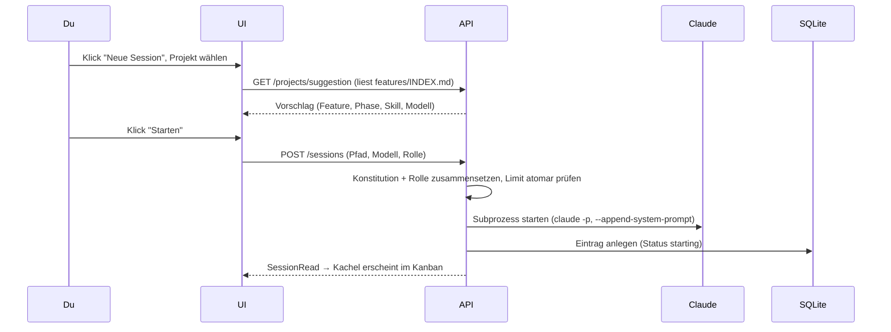

**Wer macht was:**
- **UI**: `components/cockpit/new-session-dialog.tsx`
- **Vorschlag**: `GET /projects/suggestion` → `backend/app/engine/launcher.py`
- **Start**: `POST /sessions` → `SessionManager.create()` (`backend/app/engine/manager.py`)
- **Engine**: `backend/app/engine/claude_driver.py` (Subprozess)
- **Persistenz**: `session_index`-Eintrag (`backend/app/db/`)

**Tipps zum Verstehen:**
- Der Vorschlag kommt aus der **`features/INDEX.md` des Projekts** — Jupiter „weiß" nichts magisch, es liest deine Feature-Tabelle und wählt den reifsten fortsetzbaren Stand.
- Gibt es schon zu viele aktive Sessions (Default 12), wird der Start mit einer klaren Meldung **abgelehnt** (Schutz vor VPS-Überlast), kein stiller Fehler.

### Mit Claude arbeiten (Prompt eingeben)

**Was du tust:**
1. Session öffnen.
2. Text ins Eingabefeld tippen, absenden.
3. Live-Transkript + Kontext-Füllstand beobachten.

**Was im Hintergrund passiert:**
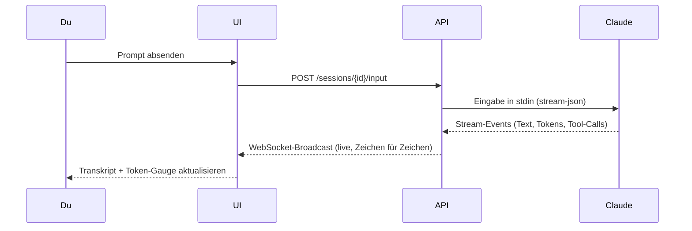

**Wer macht was:**
- **UI**: `app/(cockpit)/sessions/[id]/page.tsx`, `context-gauge.tsx`
- **API**: `POST /sessions/{id}/input` + `WS /sessions/{id}`
- **Engine**: `ClaudeCodeDriver.read_stream()` (Parser für Tokens/Kosten)

**Tipps zum Verstehen:**
- Das Live-Transkript kommt über **WebSocket**, nicht über das 4-Sekunden-Polling — deshalb erscheint Claudes Ausgabe ohne Verzögerung.
- Der Kontext-Füllstand wird aus den `result`-Events berechnet; nähert er sich der Schwelle, blinkt der Threshold-Badge → Zeit für ein Handover.

### Eine Freigabe entscheiden (Decision Card)

**Was du tust:**
1. Eine Session steht auf „wartet auf Freigabe" — eine Decision Card erscheint.
2. Du liest Was/Warum/Ausschnitt.
3. Du klickst **Freigeben**, **Ablehnen** oder **Mit Kommentar zurück**.

**Was im Hintergrund passiert:**
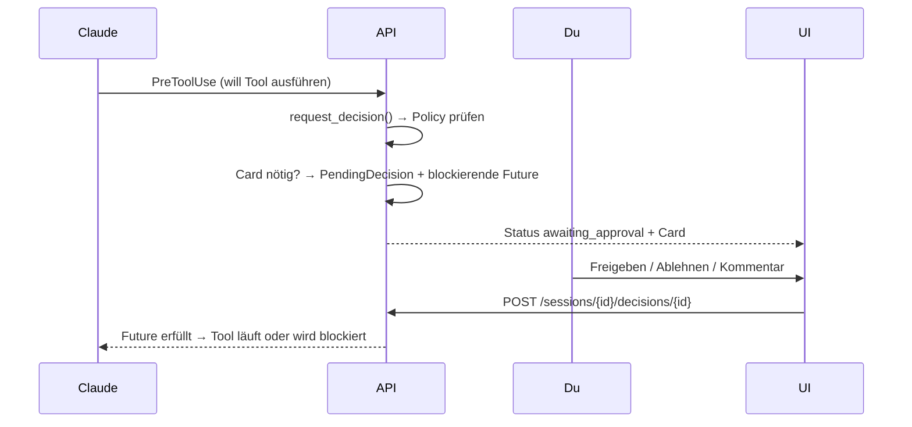

**Wer macht was:**
- **UI**: `components/cockpit/decision-card.tsx`
- **API**: `POST /sessions/{id}/decisions/{id}`
- **Logik**: `request_decision()` + `PolicyEvaluator` (`backend/app/engine/policy.py`)

**Tipps zum Verstehen:**
- Die Session ist während der Card **wirklich angehalten** — sie blockiert auf einer `Future`, der Claude-Prozess lebt aber weiter. „Pausieren statt killen".
- Ob überhaupt eine Card entsteht, entscheidet die **Trust-Policy** (`policy.yaml`): manches wird auto-erlaubt, manches braucht dich, manches wird hart verweigert.

### Eine Watchdog-Pause auflösen

**Was du tust:**
1. Eine durchdrehende Session (Endlosschleife, Token-Burn, wildes Schreiben) wird automatisch pausiert.
2. Eine amber **Watchdog-Card** nennt die gerissene Metrik.
3. Du klickst **Fortsetzen**, **Abbrechen** oder **Mit Kommentar korrigieren**.

**Was im Hintergrund passiert:**
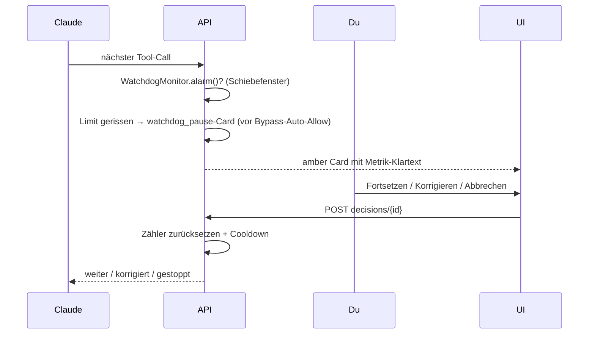

**Wer macht was:**
- **Logik**: `backend/app/engine/watchdog.py` (`WatchdogMonitor`)
- **UI**: `watchdog-control.tsx` (Limits), `decision-card.tsx` (Variante `watchdog_pause`)
- **Config**: `config/watchdog.yaml` (live editierbar)

**Tipps zum Verstehen:**
- Der Watchdog greift **vor** dem Bypass-Auto-Allow — selbst eine „darf-alles"-Session wird bei Amok angehalten. Das ist die Reißleine.
- Eine *legitime* lange Aufgabe (Codegen auf viele verschiedene Pfade) löst nicht aus — der Monitor unterscheidet Schleife (identische Wiederholung) von Iteration (wechselnder Input).

### Handover erzeugen & Session zurücksetzen

**Was du tust:**
1. Kontext-Füllstand nähert sich der Schwelle.
2. Klick auf „Handover" → editierbare Vorschau.
3. Speichern + „Zurücksetzen" → frische Kind-Session mit Seed-Kontext.

**Was im Hintergrund passiert:**
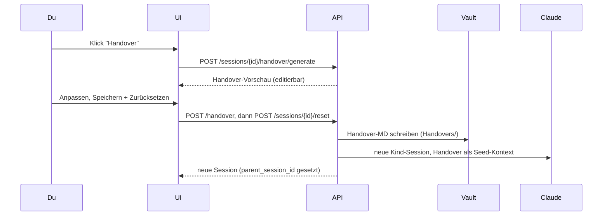

**Wer macht was:**
- **UI**: `handover-dialog.tsx`, `reset-session-button.tsx`
- **API**: `/handover/generate`, `/handover`, `/sessions/{id}/reset`
- **Persistenz**: Vault `Agentic OS/Jupiter/Handovers/`

**Tipps zum Verstehen:**
- Das Handover ist ein **echtes Markdown im Vault** — du kannst es in Obsidian lesen, und es überlebt alles. Die neue Session startet damit „frisch, aber informiert".
- `parent_session_id` verkettet alt → neu; daran hängt später auch die Recovery (siehe unten).

### Wissens-Vorschlag kuratieren

**Was du tust:**
1. Eine Session löst einen Kurations-Marker aus (z. B. „Bug gelöst", „ADR").
2. Eine Decision Card schlägt eine kuratierte Notiz vor.
3. Du editierst Titel/Text und gibst frei (oder verwirfst).

**Was im Hintergrund passiert:**
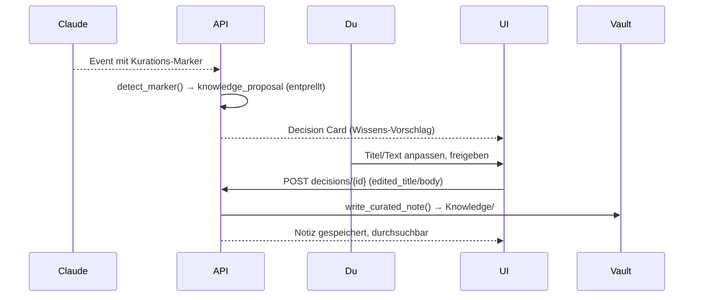

**Wer macht was:**
- **Logik**: `backend/app/engine/curation.py` (`detect_marker`, `build_proposal`)
- **UI**: `decision-card.tsx` (`knowledge_proposal`), `knowledge-search.tsx`
- **Persistenz**: Vault `Agentic OS/Jupiter/Knowledge/`

**Tipps zum Verstehen:**
- Der Vorschlag ist **nicht-blockierend** — er hält die Session nicht an, anders als eine normale Freigabe. Verwirfst du ihn, passiert nichts; gibst du frei, wächst das „lebende Gehirn".
- Dedup über einen `proposal_slug` verhindert, dass derselbe Marker dich mehrfach zumüllt.

### Doku lesen (MD-Reader)

**Was du tust:**
1. Tab „Doku" öffnen, Quelle (Vault/Projekt) wählen.
2. Im Datei-Baum navigieren, Datei anklicken.
3. Gerendertes Markdown lesen, Links folgen.

**Was im Hintergrund passiert:**
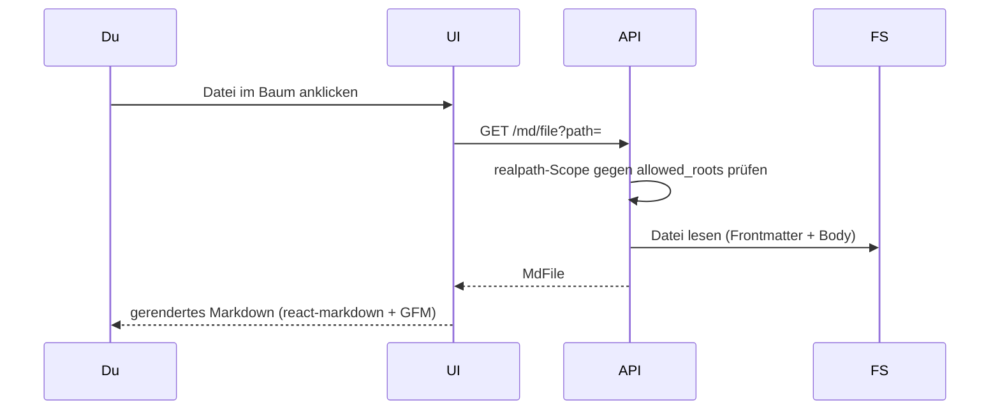

**Wer macht was:**
- **UI**: `app/(cockpit)/doku/page.tsx`, `markdown-view.tsx`, `file-tree.tsx`
- **API**: `GET /md/sources|index|file` → `backend/app/engine/md_reader.py`

**Tipps zum Verstehen:**
- Der Reader liest **read-only** aus den erlaubten Roots — er kann nichts kaputt machen, und alles außerhalb (z. B. Systemdateien) ist hart abgewiesen.
- **Hinweis:** Relative Links zwischen Specs führen aktuell teils ins Leere — Reparatur ist als PROJ-31 eingeplant.

### Doku bearbeiten (MD-Editor)

**Was du tust:**
1. In der Doku-Ansicht in den Bearbeiten-Modus wechseln.
2. Text ändern, `[[` für Autocomplete nutzen.
3. Speichern.

**Was im Hintergrund passiert:**
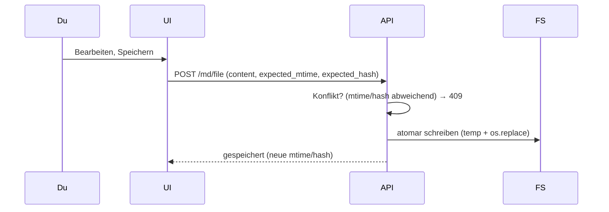

**Wer macht was:**
- **UI**: `md-editor.tsx`, `backlinks-panel.tsx`
- **API**: `POST /md/file`, `GET /md/backlinks`

**Tipps zum Verstehen:**
- Geschrieben wird **atomar** (erst temp, dann umbenennen) — eine halb geschriebene Datei kann es nicht geben.
- Hat jemand/etwas die Datei seit deinem Öffnen geändert, blockt der **Konflikt-Check** (mtime+hash) das versehentliche Überschreiben.

### Datei hochladen / Clipboard-Paste

**Was du tust:**
1. Im Fileexplorer (oder am Session-Eingabefeld) eine Datei droppen — oder **Strg/Cmd+V** für einen Screenshot.
2. Die Datei landet im Clipboard-Ordner.
3. „Pfad kopieren" bzw. der Pfad wird direkt ins Eingabefeld eingefügt.

**Was im Hintergrund passiert:**
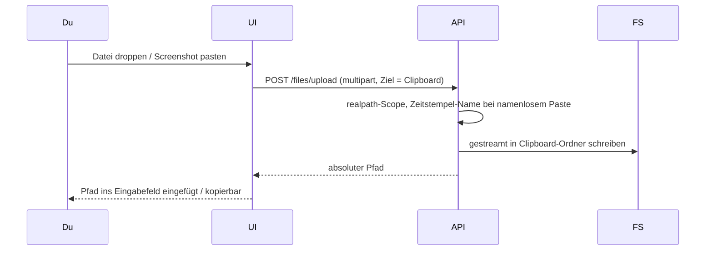

**Wer macht was:**
- **UI**: `file-explorer.tsx`, `session-clipboard-button.tsx`, `use-file-upload.ts`
- **API**: `POST /files/upload` → `backend/app/engine/files.py`
- **Storage**: Clipboard-Ordner (`/home/dev/projects/clipboard`)

**Tipps zum Verstehen:**
- Der Clou ist der **kurze, stabile Pfad**: ein gepasteter Screenshot ist sofort als `…/clipboard/clip-….png` referenzierbar — du zeigst Claude ein Bild mit einem Klick, ohne es erst zu speichern.
- Uploads werden **gestreamt**, nicht komplett in den RAM geladen — auch große Dateien sind unproblematisch (bis zum konfigurierten Limit).

### Hängende/abgebrochene Session wiederherstellen

**Was du tust:**
1. Nach einem Backend-Neustart erscheint ein **Recovery-Banner**.
2. Du öffnest den Dialog, siehst Kandidaten mit Stärke (stark/mittel/schwach).
3. Klick auf „Wiederherstellen" (oder „Verwerfen").

**Was im Hintergrund passiert:**
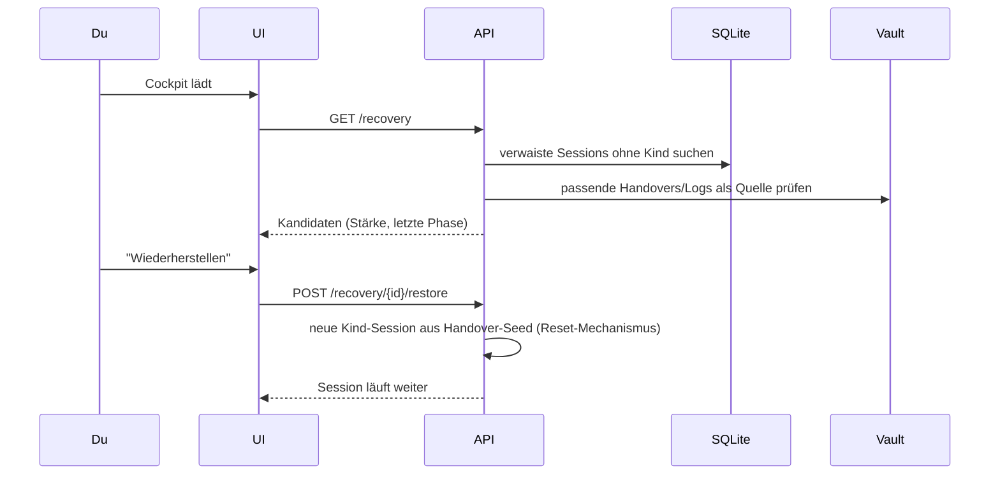

**Wer macht was:**
- **UI**: `recovery-banner.tsx`, `recovery-dialog.tsx`
- **API**: `GET /recovery`, `POST /recovery/{id}/restore|dismiss`
- **Quelle**: `session_index` (verwaist) + Vault-Handovers

**Tipps zum Verstehen:**
- Nach einem Neustart sterben die Claude-Prozesse, aber der **SQLite-Index überlebt** — deshalb ist die Liste noch da und Wiederherstellung überhaupt möglich.
- „Wiederherstellen" startet eine **neue** Session, die das Handover als Startkontext bekommt — genau wie ein manuelles Zurücksetzen.

### Session löschen / Cockpit aufräumen

**Was du tust:**
1. Auf einer fertigen/fehlerhaften Kachel das Lösch-Icon klicken — oder „Erledigte aufräumen".
2. Bestätigen.

**Was im Hintergrund passiert:**
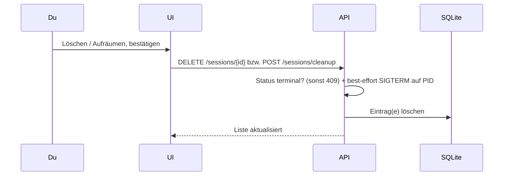

**Wer macht was:**
- **UI**: `delete-session-button.tsx`, `cleanup-button.tsx`, `confirm-dialog.tsx`
- **API**: `DELETE /sessions/{id}`, `POST /sessions/cleanup`

**Tipps zum Verstehen:**
- Nur **terminale** Sessions (fertig/Fehler/verwaist) lassen sich löschen — eine aktive Session schützt sich mit einem 409, damit du nichts Laufendes versehentlich wegwirfst.
- Falls noch ein Rest-Prozess lebt, wird er best-effort beendet (SIGTERM), bevor der Eintrag verschwindet.

### Trust-Policy / Watchdog-Limits einstellen

**Was du tust:**
1. Einstellungen öffnen → Tab „Trust-Policy" bzw. „Watchdog".
2. Regeln/Limits anpassen, speichern.

**Was im Hintergrund passiert:**
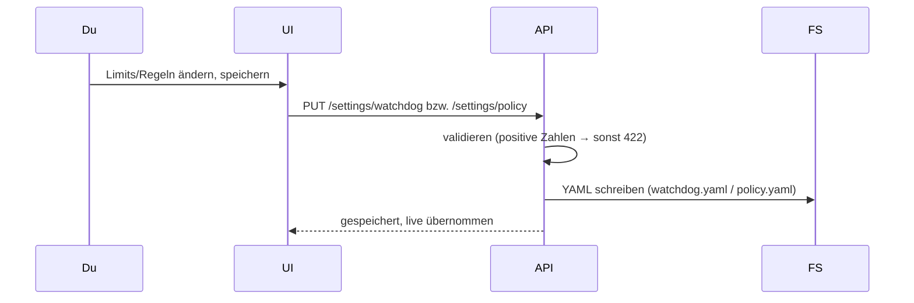

**Wer macht was:**
- **UI**: `policy-control.tsx`, `watchdog-control.tsx` (im `settings-dialog.tsx`)
- **API**: `GET/PUT /settings/policy|watchdog`
- **Config**: `config/policy.yaml`, `config/watchdog.yaml`

**Tipps zum Verstehen:**
- Änderungen greifen **live** (mtime-Watch) — kein Neustart. Ist die Datei defekt/fehlt, fallen konservative Defaults ein (nie „kein Schutz").

### Einloggen (JWT-Auth)

**Was du tust:**
1. Öffne `https://jupiter.auxevo.tech` — du landest auf dem Login-Screen.
2. Gib Benutzername und Passwort ein, klicke **„Anmelden"**.
3. Erster Start: Jupiter fragt nach einem Account — **Bootstrap** einmalig ausfüllen.

**Was im Hintergrund passiert:**
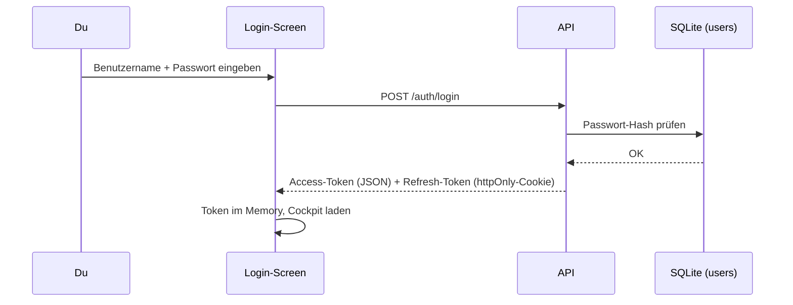

**Wer macht was:**
- **UI**: `app/login/page.tsx`, `login-form.tsx`
- **API**: `POST /auth/login` → `backend/app/engine/auth.py`
- **DB**: Tabellen `users`, `refresh_token_registry`

**Tipps zum Verstehen:**
- Der Access-Token läuft nach **15 Minuten** ab; das Browser-Tab holt via httpOnly-Cookie automatisch einen neuen. Du musst dich im Normalbetrieb nie erneut anmelden.
- Bei zu vielen Fehlversuchen (5/30 s) sperrt das Rate-Limit den Login kurz — Schutz gegen Brute-Force.

---

### Git-Branch wechseln / Feature-Branch anlegen

**Was du tust:**
1. Im Fileexplorer das **Branch-Panel** öffnen.
2. Bestehenden Branch wählen (wechseln) **oder** Namen für neuen Feature-Branch eingeben.
3. Klicken — fertig.

**Was im Hintergrund passiert:**
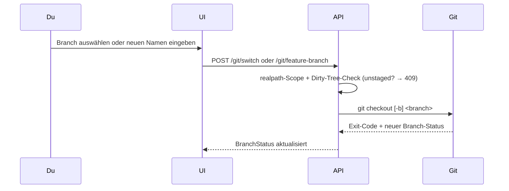

**Wer macht was:**
- **UI**: `branch-panel.tsx` (im Dateien-Bereich)
- **API**: `POST /git/switch`, `POST /git/feature-branch` → `backend/app/engine/git_service.py`

**Tipps zum Verstehen:**
- Hat das Repo **uncommittete Änderungen**, blockiert der API-Aufruf mit 409 — du musst erst committen oder stashen.
- Feature-Branches bekommen automatisch einen Slug aus der Spec (z. B. `feat/PROJ-X-name`).

---

### Spracheingabe / Push-to-Talk

**Was du tust:**
1. In der Session auf den **Mikrofon-Button** drücken und gedrückt halten.
2. Sprechen.
3. Loslassen — der Text erscheint im Eingabefeld und wird ans Ende angefügt.

**Was im Hintergrund passiert:**
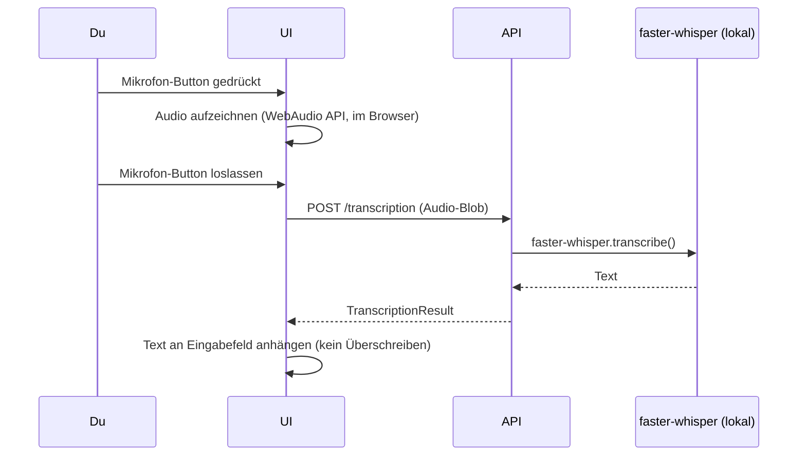

**Wer macht was:**
- **UI**: `push-to-talk-button.tsx`, `sessions/[id]/page.tsx`
- **API**: `POST /transcription` → `backend/app/engine/transcription.py`

**Tipps zum Verstehen:**
- Whisper läuft **lokal** auf dem VPS — kein US-Dienst, DSGVO-konform. Optionaler Groq-Fallback (Cloud) nur bei expliziter Aktivierung.
- Text wird **angehängt**, nicht ersetzt — du kannst erst tippen, dann nochmal diktieren.

---

### Multi-Agent-Fleet starten (Coordinator)

**Was du tust:**
1. In einer Koordinator-Session das **Dispatch-Panel** öffnen.
2. Den topologisch sortierten Plan ansehen (welches Ticket, welche Abhängigkeiten).
3. Plan freigeben — Jupiter startet die Kind-Sessions.

**Was im Hintergrund passiert:**
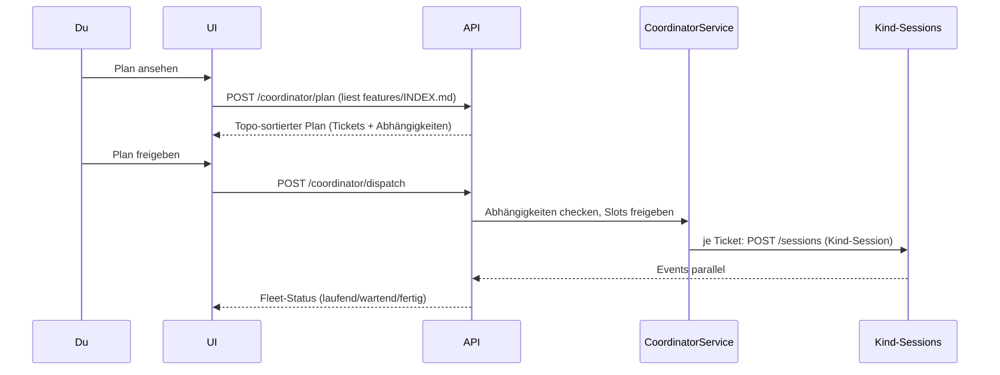

**Wer macht was:**
- **UI**: `fleet-view.tsx`, `coordinator-panel.tsx`, `dispatch-plan-dialog.tsx`
- **API**: `POST /coordinator/plan|dispatch` → `backend/app/engine/coordinator.py`
- **Daten**: `features/INDEX.md` des Projekts + Session-Parent-Child-Baum

**Tipps zum Verstehen:**
- Tickets mit unerfüllten Abhängigkeiten werden **automatisch blockiert** — sie warten in der Queue, bis das vorgelagerte Ticket fertig ist.
- Du kannst die Fleet jederzeit pausieren oder einzelne Tickets neu zuweisen (andere Rolle, andere Engine).

---

### Cross-Agent-Review starten

**Was du tust:**
1. In einer Session auf **„Review starten"** klicken.
2. Reviewer-Engine und Fokus (z. B. „Sicherheit", „Korrektheit") wählen.
3. Findings in der Reviews-Panel-Ansicht einzeln entscheiden (Annehmen / Ablehnen / Kommentar).

**Was im Hintergrund passiert:**
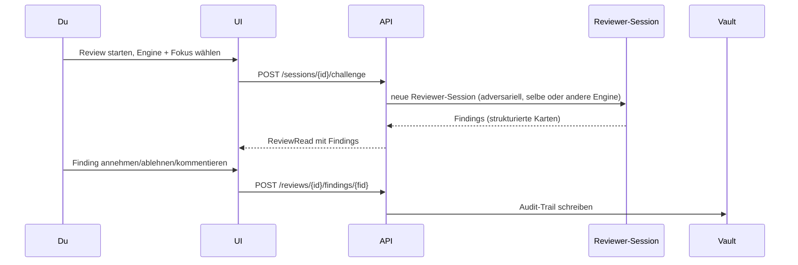

**Wer macht was:**
- **UI**: `challenge-dialog.tsx`, `reviews-panel.tsx`, `review-finding.tsx`
- **API**: `/sessions/{id}/challenge`, `/reviews/{id}` → `backend/app/engine/challenge.py`

**Tipps zum Verstehen:**
- Der Reviewer wird bewusst **adversariell** instruiert — er sucht Fehler, nicht Bestätigung.
- Jede Finding-Entscheidung landet als Audit-Trail im Vault, auch verworfene Findings.

---

### Marktplatz: Rollen, Skills, Agenten verwalten

**Was du tust:**
1. Öffne den **Marktplatz** (Sidebar oder `/apps`-Route).
2. Katalog durchsuchen oder eine **`.jupkg`-Datei hochladen**.
3. Import-Preview prüfen (Capabilities, Policy-Impact), bestätigen.
4. Eintrag **installieren** und **aktivieren**.

**Was im Hintergrund passiert:**
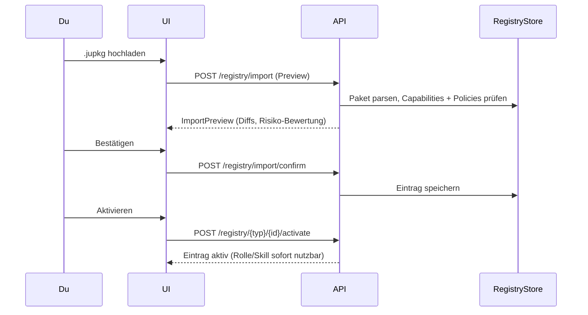

**Wer macht was:**
- **UI**: `registry-control.tsx`, `(cockpit)/apps/[key]/page.tsx`
- **API**: `/registry/*` → `backend/app/engine/marketplace.py`

**Tipps zum Verstehen:**
- Import ist **zweistufig** (Preview → Confirm) — du siehst immer, was sich ändert, bevor es wirksam wird.
- Rollen werden nach Aktivierung sofort im Session-Dialog angeboten; Skills in der Konstitution nutzbar.

---

### Session reanimieren (Liveness + Auto-Restart)

**Was du tust:**
1. Eine Session zeigt „hängt" — der **Heartbeat-Dot** ist rot.
2. Jupiter versucht es **automatisch** (bis zum Budget, Standard: 2 Versuche).
3. Nach Erschöpfen des Budgets: **Manuell reanimieren** klicken.

**Was im Hintergrund passiert:**
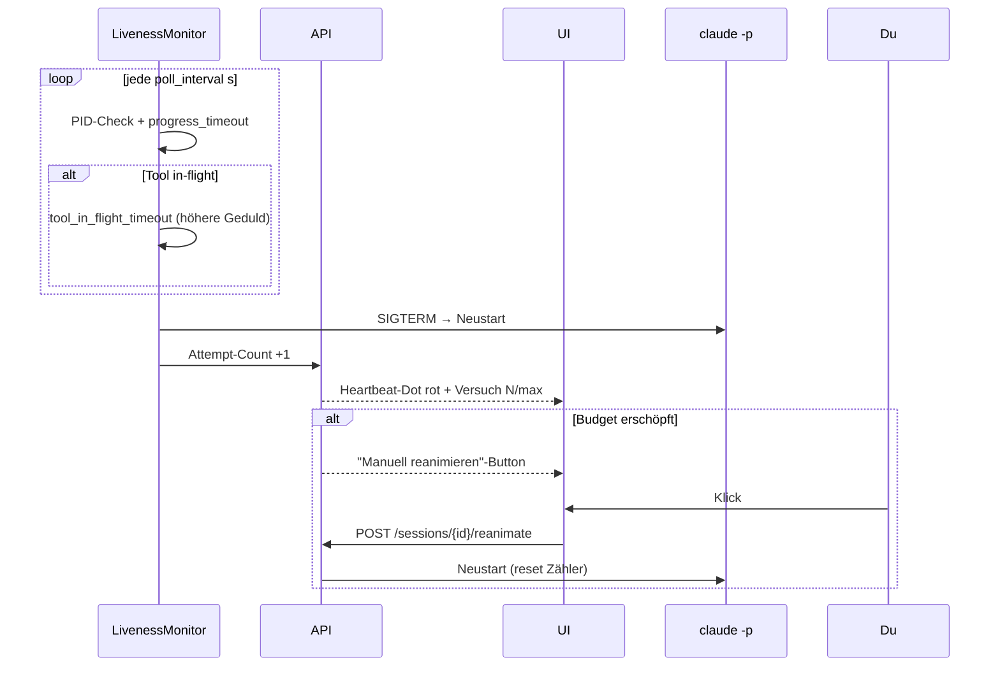

**Wer macht was:**
- **Logik**: `backend/app/engine/liveness.py` (`LivenessMonitor`) + `config/liveness.yaml`
- **UI**: `heartbeat-dot.tsx`, `reanimate-button.tsx`, `liveness-control.tsx`

**Tipps zum Verstehen:**
- Jupiter **wartet länger**, wenn ein Tool gerade läuft (PROJ-32 Tool-in-Flight-Flag) — so werden legitim lange Operationen nicht fälschlicherweise als „hängt" bewertet.
- Nach dem Budget: nur noch manuelles Reanimieren — verhindert Endlosschleifen (PROJ-45-Hysterese).

---

### Live-Aktivität beobachten (Aktivitäts-Ticker)

**Was du tust:**
1. In einer laufenden Session den **Aktivitäts-Ticker** unten im Transkript-Bereich beobachten.
2. Er zeigt: welches Tool gerade läuft, Ziel-Datei, kurzer Text-Ausschnitt.
3. Zum Ausblenden einklappen.

**Was im Hintergrund passiert:**
```mermaid
sequenceDiagram
  participant CC as claude -p
  participant API
  participant UI
  CC->>API: Tool-Start Event
  API->>API: Aktivitäts-Payload bauen (Tool, Target, Snippet)
  API-->>UI: WS kind:"activity" (transient)
  UI->>UI: activity-ticker aktualisieren
  Note over UI: Kein REST-Pull; rein WS-getrieben; keine History
```

**Wer macht was:**
- **API**: Event-Broadcast in `routes/sessions.py`
- **UI**: `activity-ticker.tsx` in `sessions/[id]/page.tsx`

**Tipps zum Verstehen:**
- Der Ticker ist **transient** — er zeigt das Jetzt, keine Vergangenheit. Für die volle History ist das Transkript zuständig.
- Im Bypass-Modus (auto-allow) ist das der einzige Weg zu sehen, was der Agent gerade tut, ohne auf Decision Cards zu warten.

---

### Video zusammenfassen (Video Summary)

**Was du tust:**
1. Öffne die **Video-Summary-Micro-App** in der Sidebar.
2. Video-URL(s) einfügen → **„In Warteschlange"**.
3. Modell und Standard-Ordner ggf. anpassen.
4. **„Jetzt starten"** oder automatisch im Hintergrund abarbeiten lassen.
5. Fertiges Summary in der **Bibliothek** ansehen.

**Was im Hintergrund passiert:**
```mermaid
sequenceDiagram
  participant Du
  participant UI
  participant API
  participant Worker as VideoSummaryWorker
  participant Vault
  Du->>UI: URL einfügen + In Warteschlange
  UI->>API: POST /video-summary/queue
  API->>Worker: URL zur Queue hinzufügen (SQLite)
  Du->>UI: Jetzt starten
  UI->>API: POST /video-summary/run-now
  Worker->>Worker: hal-video-summary-Skill (transkribieren + zusammenfassen)
  Worker->>Vault: Summary-MD schreiben (Standard-Ordner)
  API-->>UI: Queue-Status aktualisiert
```

**Wer macht was:**
- **UI**: Video-Summary-Micro-App (Sidebar)
- **API**: `/video-summary/*` → `backend/app/engine/video_summary.py`
- **Persistenz**: `video_summary_queue` (SQLite) + Summary im Vault

**Tipps zum Verstehen:**
- Der Worker läuft **nicht-interaktiv** — er braucht keine Eingabe während der Verarbeitung.
- Modell-Wahl ist **persistent** — du musst es nicht jedes Mal neu wählen.

---

### VPS-Admin: Metriken & Terminal

**Was du tust:**
1. **Dashboard**: Öffne die VPS-Admin-Micro-App → sieh CPU/RAM/Disk/Load als Ampel.
2. **Terminal**: Klick auf „Terminal öffnen" → ttyd-Shell im Browser-Tab.

**Was im Hintergrund passiert:**
```mermaid
sequenceDiagram
  participant Du
  participant UI
  participant API
  participant OS as VPS-OS

  Du->>UI: VPS-Admin öffnen (Dashboard)
  UI->>API: GET /metrics/current
  API->>OS: psutil (CPU/RAM/Disk/Load)
  OS-->>API: Metriken (gecacht per Tick)
  API-->>UI: MetricsSnapshot (Ampelfarben)

  Du->>UI: Terminal öffnen
  UI->>API: GET /terminal/info
  API->>OS: TCP-Probe auf ttyd-Port
  OS-->>API: erreichbar/nicht erreichbar
  API-->>UI: TerminalInfo (URL)
  UI->>UI: ttyd in iFrame einbetten
```

**Wer macht was:**
- **UI**: VPS-Admin-Micro-App, `ampel.tsx`, `embed-tab.tsx`
- **API**: `GET /metrics/current` → `engine/metrics.py`; `GET /terminal/info` → `routes/terminal.py`

**Tipps zum Verstehen:**
- Metriken sind **read-only** und gecacht — sie verursachen keine Abfragelast pro Seitenaufruf.
- Das Terminal ist **echte Shell auf dem VPS** — mit ttyd läuft ein vollwertiger Shell-Tab im Browser.

---

### Sidebar anpassen (Sektionen, Micro-Apps, Orchestration)

**Was du tust:**
1. Klicke das **Konfig-Icon** im Sidebar-Header → Konfig-Panel öffnet sich.
2. Sektionen ein-/ausblenden oder per Drag-and-Drop umsortieren.
3. **Speichern** — Präferenzen bleiben auch nach Reload erhalten.

**Was im Hintergrund passiert:**
```mermaid
sequenceDiagram
  participant Du
  participant UI
  participant LS as localStorage
  Du->>UI: Konfig-Panel öffnen
  UI->>LS: Prefs laden (Reihenfolge, Sichtbarkeit)
  Du->>UI: Sektion ausblenden oder verschieben
  Du->>UI: Speichern
  UI->>LS: Prefs schreiben
  UI->>UI: Sidebar neu rendern (sofort)
```

**Wer macht was:**
- **UI**: `sidebar-config-panel.tsx`, `sidebar-prefs-provider.tsx`, `session-rail.tsx`
- **Persistenz**: `localStorage` (kein Backend nötig)

**Tipps zum Verstehen:**
- Die **Workspace-Sektion** ist immer sichtbar — so kommst du nie ans Konfig-Panel nicht heran.
- Micro-Apps und Orchestration-Apps kommen aus der **Registry** — nach einer neuen Installation erscheinen sie automatisch in der Sidebar ohne Neustart.

---

## Wiederkehrende Muster

Fast jede Lese-Ansicht im Cockpit folgt demselben Standard-Muster — die einzelnen Funktionen oben verweisen darauf, statt es zu wiederholen:

```mermaid
sequenceDiagram
  participant UI
  participant API
  participant Store as In-Memory / SQLite / FS
  loop Polling alle 4 s
    UI->>API: GET /... (Liste/Datei)
    API->>API: realpath-Scope / Status-Mapping
    API->>Store: lesen (in-memory führt, SQLite spiegelt)
    Store-->>API: Daten
    API-->>UI: JSON
    UI->>UI: Rendern (Kanban / Gantt / Baum)
  end
  Note over UI,API: Offene Session zusätzlich per WebSocket (live, ohne Polling-Verzögerung)
```

- **In-Memory führt, SQLite spiegelt:** Der Live-Zustand lebt im RAM des Backends; SQLite ist nur der Restart-Spiegel. Deshalb ist alles schnell — und nach einem Neustart trotzdem nicht weg.
- **Vault ist die Wahrheit:** Logs, Handovers und kuratiertes Wissen liegen als offenes Markdown im Hal-Vault — lesbar in Obsidian, unabhängig von Jupiter.
- **`realpath`-Scope ist die Schutzgrenze:** Statt Mandanten-Isolation (gibt es nicht) schützt die Pfad-Normalisierung gegen Ausbruch aus den erlaubten Roots.
