# Funktionen — Ablauf hinter den Kulissen

## Über dieses Dokument

Dieses Dokument erklärt **was im Hintergrund passiert**, wenn du in Jupiter eine konkrete Aktion auslöst — vom Klick im Browser über die API bis zum Claude-Subprozess, zur SQLite-Datei und zum Vault. Es ist kein Bedien-Handbuch (das ist die [Benutzeranleitung](benutzeranleitung.md)) und keine Code-Referenz (das ist die [Architektur](architektur.md)), sondern die Brücke dazwischen: das mentale Modell, *warum* etwas schnell ist, *warum* etwas auch nach einem Neustart noch da ist, *warum* eine Session anhält.

## Wie liest du die Diagramme?

- **Du** = der Browser-Tab vor dir
- **UI** = Next.js-Cockpit (clientseitiger Code)
- **API** = FastAPI-Server (Backend)
- **Claude** = der `claude -p`-Subprozess der Session
- **SQLite** = der Live-Index (`session_index.db`, übersteht Neustarts)
- **Vault** = der Hal-Obsidian-Vault (Markdown, persistente Wahrheit)
- **FS** = host-natives Dateisystem (Dateien, Clipboard)
- durchgezogener Pfeil `->>` = Anfrage / Aktion
- gestrichelter Pfeil `-->>` = Antwort / Ergebnis

> Wiederkehrendes Muster: Das Cockpit fragt den Zustand **alle 4 Sekunden** per `GET /sessions` ab (Polling) und bekommt für die offene Session zusätzlich einen **WebSocket-Live-Stream**. Viele „warum sehe ich das sofort?"-Fragen beantwortet das — siehe [Wiederkehrende Muster](#wiederkehrende-muster) am Ende.

## Funktionen

### Neue Session starten

**Was du tust:**
1. Klick auf „Neue Session" im Cockpit.
2. Projekt wählen — der **Smart Launcher** schlägt Feature, Phase, Skill und Modell vor (überschreibbar).
3. Klick auf „Starten".

**Was im Hintergrund passiert:**
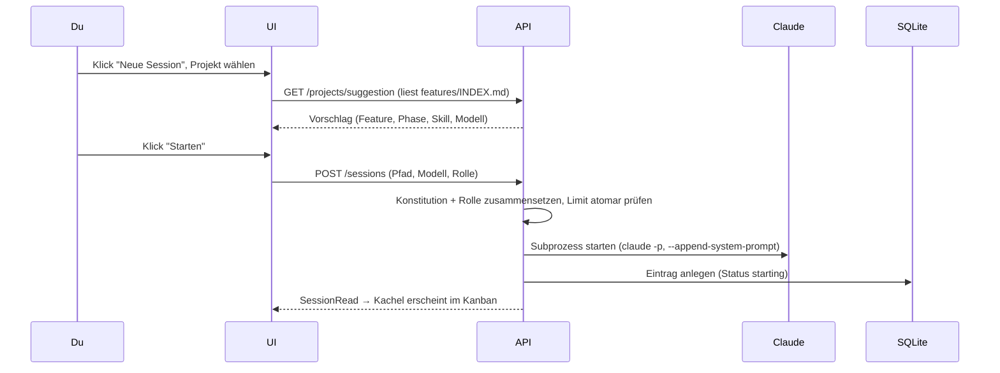

**Wer macht was:**
- **UI**: `components/cockpit/new-session-dialog.tsx`
- **Vorschlag**: `GET /projects/suggestion` → `backend/app/engine/launcher.py`
- **Start**: `POST /sessions` → `SessionManager.create()` (`backend/app/engine/manager.py`)
- **Engine**: `backend/app/engine/claude_driver.py` (Subprozess)
- **Persistenz**: `session_index`-Eintrag (`backend/app/db/`)

**Tipps zum Verstehen:**
- Der Vorschlag kommt aus der **`features/INDEX.md` des Projekts** — Jupiter „weiß" nichts magisch, es liest deine Feature-Tabelle und wählt den reifsten fortsetzbaren Stand.
- Gibt es schon zu viele aktive Sessions (Default 12), wird der Start mit einer klaren Meldung **abgelehnt** (Schutz vor VPS-Überlast), kein stiller Fehler.

### Mit Claude arbeiten (Prompt eingeben)

**Was du tust:**
1. Session öffnen.
2. Text ins Eingabefeld tippen, absenden.
3. Live-Transkript + Kontext-Füllstand beobachten.

**Was im Hintergrund passiert:**
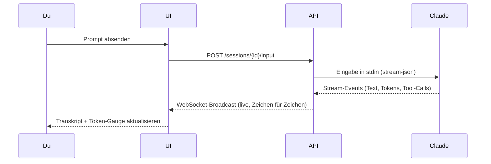

**Wer macht was:**
- **UI**: `app/(cockpit)/sessions/[id]/page.tsx`, `context-gauge.tsx`
- **API**: `POST /sessions/{id}/input` + `WS /sessions/{id}`
- **Engine**: `ClaudeCodeDriver.read_stream()` (Parser für Tokens/Kosten)

**Tipps zum Verstehen:**
- Das Live-Transkript kommt über **WebSocket**, nicht über das 4-Sekunden-Polling — deshalb erscheint Claudes Ausgabe ohne Verzögerung.
- Der Kontext-Füllstand wird aus den `result`-Events berechnet; nähert er sich der Schwelle, blinkt der Threshold-Badge → Zeit für ein Handover.

### Eine Freigabe entscheiden (Decision Card)

**Was du tust:**
1. Eine Session steht auf „wartet auf Freigabe" — eine Decision Card erscheint.
2. Du liest Was/Warum/Ausschnitt.
3. Du klickst **Freigeben**, **Ablehnen** oder **Mit Kommentar zurück**.

**Was im Hintergrund passiert:**
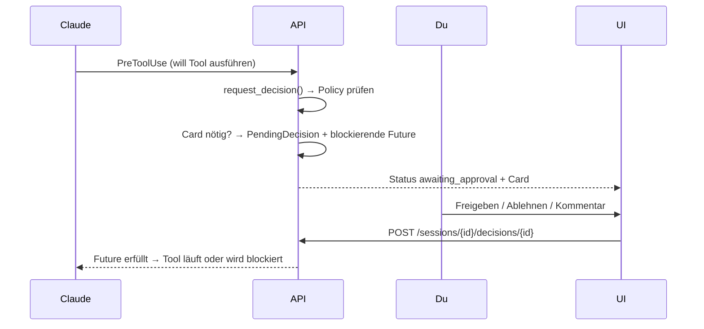

**Wer macht was:**
- **UI**: `components/cockpit/decision-card.tsx`
- **API**: `POST /sessions/{id}/decisions/{id}`
- **Logik**: `request_decision()` + `PolicyEvaluator` (`backend/app/engine/policy.py`)

**Tipps zum Verstehen:**
- Die Session ist während der Card **wirklich angehalten** — sie blockiert auf einer `Future`, der Claude-Prozess lebt aber weiter. „Pausieren statt killen".
- Ob überhaupt eine Card entsteht, entscheidet die **Trust-Policy** (`policy.yaml`): manches wird auto-erlaubt, manches braucht dich, manches wird hart verweigert.

### Eine Watchdog-Pause auflösen

**Was du tust:**
1. Eine durchdrehende Session (Endlosschleife, Token-Burn, wildes Schreiben) wird automatisch pausiert.
2. Eine amber **Watchdog-Card** nennt die gerissene Metrik.
3. Du klickst **Fortsetzen**, **Abbrechen** oder **Mit Kommentar korrigieren**.

**Was im Hintergrund passiert:**
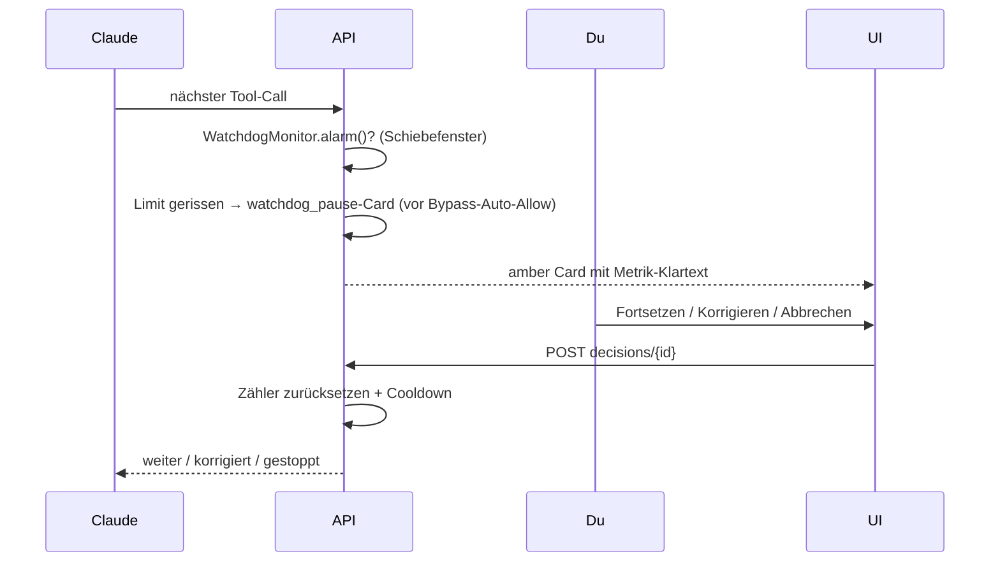

**Wer macht was:**
- **Logik**: `backend/app/engine/watchdog.py` (`WatchdogMonitor`)
- **UI**: `watchdog-control.tsx` (Limits), `decision-card.tsx` (Variante `watchdog_pause`)
- **Config**: `config/watchdog.yaml` (live editierbar)

**Tipps zum Verstehen:**
- Der Watchdog greift **vor** dem Bypass-Auto-Allow — selbst eine „darf-alles"-Session wird bei Amok angehalten. Das ist die Reißleine.
- Eine *legitime* lange Aufgabe (Codegen auf viele verschiedene Pfade) löst nicht aus — der Monitor unterscheidet Schleife (identische Wiederholung) von Iteration (wechselnder Input).

### Handover erzeugen & Session zurücksetzen

**Was du tust:**
1. Kontext-Füllstand nähert sich der Schwelle.
2. Klick auf „Handover" → editierbare Vorschau.
3. Speichern + „Zurücksetzen" → frische Kind-Session mit Seed-Kontext.

**Was im Hintergrund passiert:**
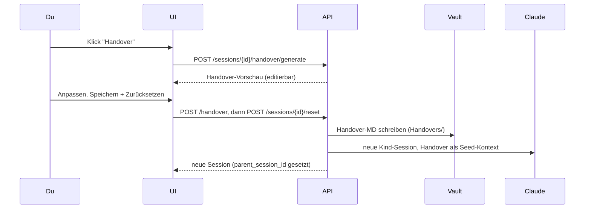

**Wer macht was:**
- **UI**: `handover-dialog.tsx`, `reset-session-button.tsx`
- **API**: `/handover/generate`, `/handover`, `/sessions/{id}/reset`
- **Persistenz**: Vault `Agentic OS/Jupiter/Handovers/`

**Tipps zum Verstehen:**
- Das Handover ist ein **echtes Markdown im Vault** — du kannst es in Obsidian lesen, und es überlebt alles. Die neue Session startet damit „frisch, aber informiert".
- `parent_session_id` verkettet alt → neu; daran hängt später auch die Recovery (siehe unten).

### Wissens-Vorschlag kuratieren

**Was du tust:**
1. Eine Session löst einen Kurations-Marker aus (z. B. „Bug gelöst", „ADR").
2. Eine Decision Card schlägt eine kuratierte Notiz vor.
3. Du editierst Titel/Text und gibst frei (oder verwirfst).

**Was im Hintergrund passiert:**
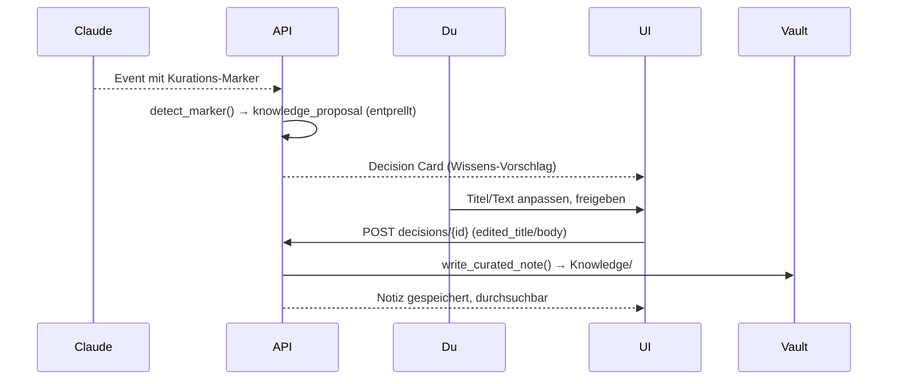

**Wer macht was:**
- **Logik**: `backend/app/engine/curation.py` (`detect_marker`, `build_proposal`)
- **UI**: `decision-card.tsx` (`knowledge_proposal`), `knowledge-search.tsx`
- **Persistenz**: Vault `Agentic OS/Jupiter/Knowledge/`

**Tipps zum Verstehen:**
- Der Vorschlag ist **nicht-blockierend** — er hält die Session nicht an, anders als eine normale Freigabe. Verwirfst du ihn, passiert nichts; gibst du frei, wächst das „lebende Gehirn".
- Dedup über einen `proposal_slug` verhindert, dass derselbe Marker dich mehrfach zumüllt.

### Doku lesen (MD-Reader)

**Was du tust:**
1. Tab „Doku" öffnen, Quelle (Vault/Projekt) wählen.
2. Im Datei-Baum navigieren, Datei anklicken.
3. Gerendertes Markdown lesen, Links folgen.

**Was im Hintergrund passiert:**
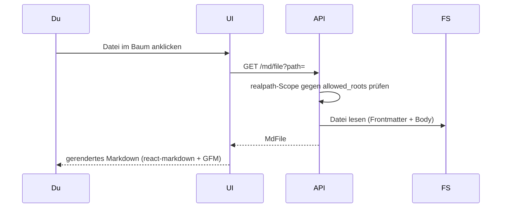

**Wer macht was:**
- **UI**: `app/(cockpit)/doku/page.tsx`, `markdown-view.tsx`, `file-tree.tsx`
- **API**: `GET /md/sources|index|file` → `backend/app/engine/md_reader.py`

**Tipps zum Verstehen:**
- Der Reader liest **read-only** aus den erlaubten Roots — er kann nichts kaputt machen, und alles außerhalb (z. B. Systemdateien) ist hart abgewiesen.
- **Hinweis:** Relative Links zwischen Specs führen aktuell teils ins Leere — Reparatur ist als PROJ-31 eingeplant.

### Doku bearbeiten (MD-Editor)

**Was du tust:**
1. In der Doku-Ansicht in den Bearbeiten-Modus wechseln.
2. Text ändern, `[[` für Autocomplete nutzen.
3. Speichern.

**Was im Hintergrund passiert:**
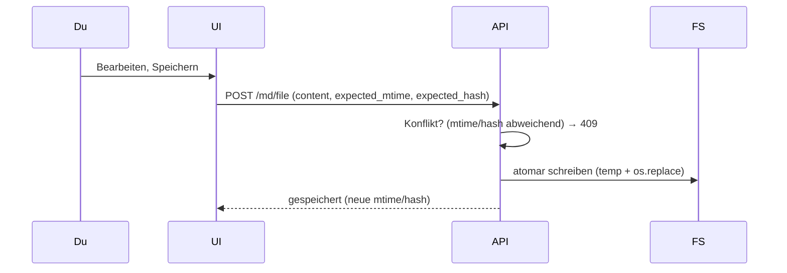

**Wer macht was:**
- **UI**: `md-editor.tsx`, `backlinks-panel.tsx`
- **API**: `POST /md/file`, `GET /md/backlinks`

**Tipps zum Verstehen:**
- Geschrieben wird **atomar** (erst temp, dann umbenennen) — eine halb geschriebene Datei kann es nicht geben.
- Hat jemand/etwas die Datei seit deinem Öffnen geändert, blockt der **Konflikt-Check** (mtime+hash) das versehentliche Überschreiben.

### Datei hochladen / Clipboard-Paste

**Was du tust:**
1. Im Fileexplorer (oder am Session-Eingabefeld) eine Datei droppen — oder **Strg/Cmd+V** für einen Screenshot.
2. Die Datei landet im Clipboard-Ordner.
3. „Pfad kopieren" bzw. der Pfad wird direkt ins Eingabefeld eingefügt.

**Was im Hintergrund passiert:**
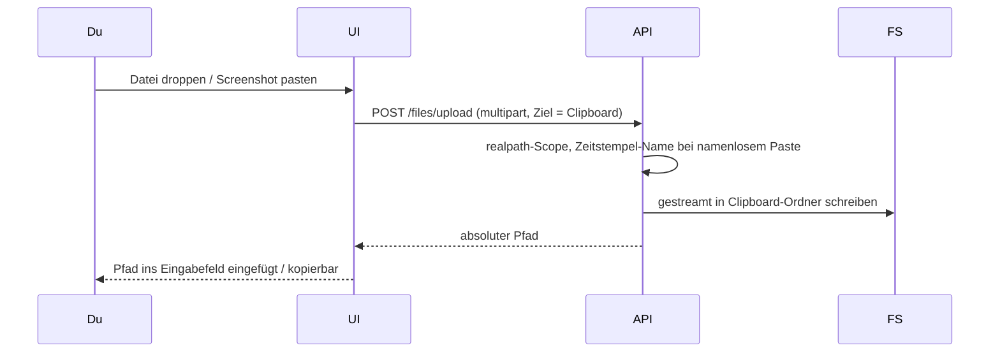

**Wer macht was:**
- **UI**: `file-explorer.tsx`, `session-clipboard-button.tsx`, `use-file-upload.ts`
- **API**: `POST /files/upload` → `backend/app/engine/files.py`
- **Storage**: Clipboard-Ordner (`/home/dev/projects/clipboard`)

**Tipps zum Verstehen:**
- Der Clou ist der **kurze, stabile Pfad**: ein gepasteter Screenshot ist sofort als `…/clipboard/clip-….png` referenzierbar — du zeigst Claude ein Bild mit einem Klick, ohne es erst zu speichern.
- Uploads werden **gestreamt**, nicht komplett in den RAM geladen — auch große Dateien sind unproblematisch (bis zum konfigurierten Limit).

### Hängende/abgebrochene Session wiederherstellen

**Was du tust:**
1. Nach einem Backend-Neustart erscheint ein **Recovery-Banner**.
2. Du öffnest den Dialog, siehst Kandidaten mit Stärke (stark/mittel/schwach).
3. Klick auf „Wiederherstellen" (oder „Verwerfen").

**Was im Hintergrund passiert:**
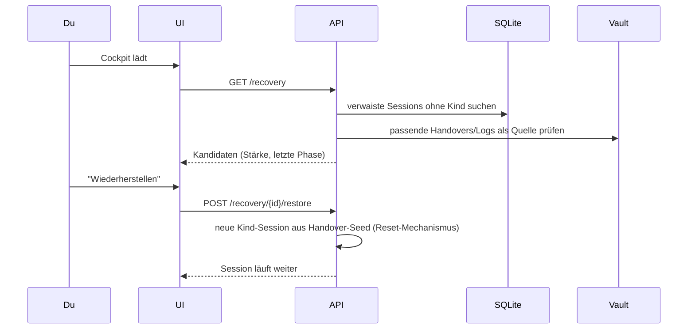

**Wer macht was:**
- **UI**: `recovery-banner.tsx`, `recovery-dialog.tsx`
- **API**: `GET /recovery`, `POST /recovery/{id}/restore|dismiss`
- **Quelle**: `session_index` (verwaist) + Vault-Handovers

**Tipps zum Verstehen:**
- Nach einem Neustart sterben die Claude-Prozesse, aber der **SQLite-Index überlebt** — deshalb ist die Liste noch da und Wiederherstellung überhaupt möglich.
- „Wiederherstellen" startet eine **neue** Session, die das Handover als Startkontext bekommt — genau wie ein manuelles Zurücksetzen.

### Session löschen / Cockpit aufräumen

**Was du tust:**
1. Auf einer fertigen/fehlerhaften Kachel das Lösch-Icon klicken — oder „Erledigte aufräumen".
2. Bestätigen.

**Was im Hintergrund passiert:**
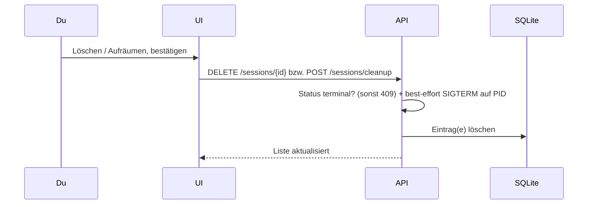

**Wer macht was:**
- **UI**: `delete-session-button.tsx`, `cleanup-button.tsx`, `confirm-dialog.tsx`
- **API**: `DELETE /sessions/{id}`, `POST /sessions/cleanup`

**Tipps zum Verstehen:**
- Nur **terminale** Sessions (fertig/Fehler/verwaist) lassen sich löschen — eine aktive Session schützt sich mit einem 409, damit du nichts Laufendes versehentlich wegwirfst.
- Falls noch ein Rest-Prozess lebt, wird er best-effort beendet (SIGTERM), bevor der Eintrag verschwindet.

### Trust-Policy / Watchdog-Limits einstellen

**Was du tust:**
1. Einstellungen öffnen → Tab „Trust-Policy" bzw. „Watchdog".
2. Regeln/Limits anpassen, speichern.

**Was im Hintergrund passiert:**
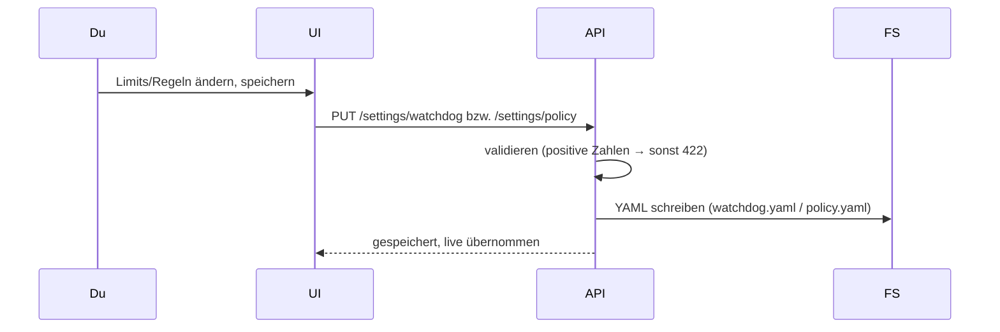

**Wer macht was:**
- **UI**: `policy-control.tsx`, `watchdog-control.tsx` (im `settings-dialog.tsx`)
- **API**: `GET/PUT /settings/policy|watchdog`
- **Config**: `config/policy.yaml`, `config/watchdog.yaml`

**Tipps zum Verstehen:**
- Änderungen greifen **live** (mtime-Watch) — kein Neustart. Ist die Datei defekt/fehlt, fallen konservative Defaults ein (nie „kein Schutz").

## Wiederkehrende Muster

Fast jede Lese-Ansicht im Cockpit folgt demselben Standard-Muster — die einzelnen Funktionen oben verweisen darauf, statt es zu wiederholen:

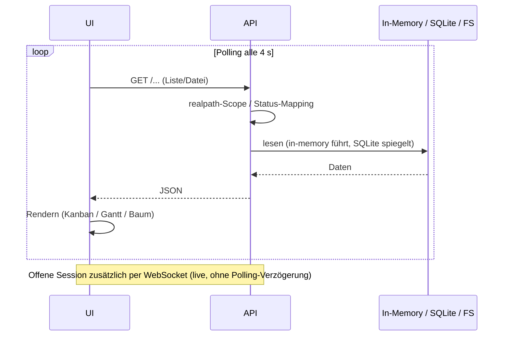

- **In-Memory führt, SQLite spiegelt:** Der Live-Zustand lebt im RAM des Backends; SQLite ist nur der Restart-Spiegel. Deshalb ist alles schnell — und nach einem Neustart trotzdem nicht weg.
- **Vault ist die Wahrheit:** Logs, Handovers und kuratiertes Wissen liegen als offenes Markdown im Hal-Vault — lesbar in Obsidian, unabhängig von Jupiter.
- **`realpath`-Scope ist die Schutzgrenze:** Statt Mandanten-Isolation (gibt es nicht) schützt die Pfad-Normalisierung gegen Ausbruch aus den erlaubten Roots.
